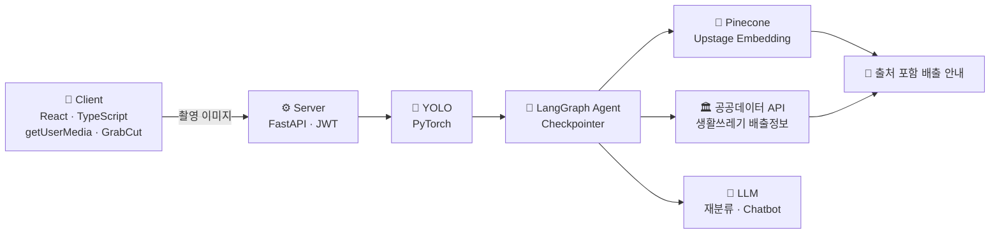
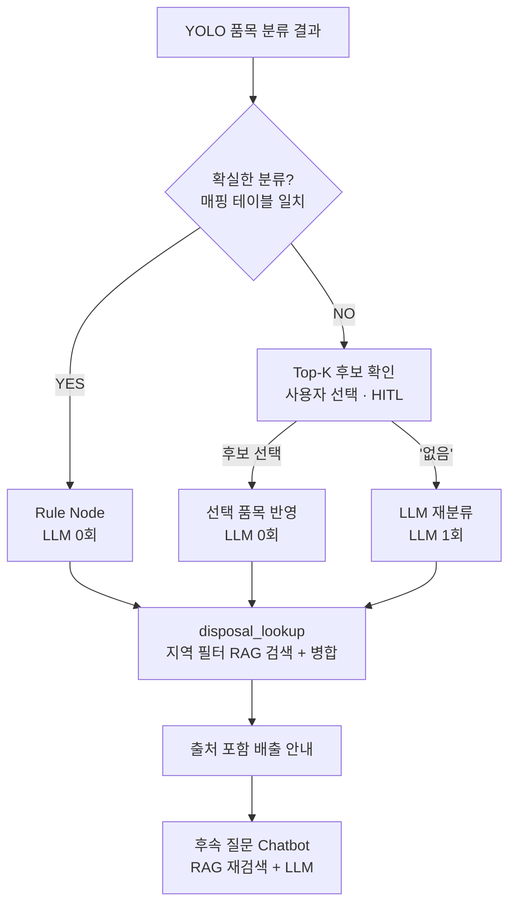

<div align="center">

# ♻️ 분리쏙

**찍으면 끝나는 분리배출, 우리 동네 규정까지**

사진 한 장으로 품목을 인식하고, 사용자가 사는 지역의 분리배출 규정을 근거로 배출 방법을 안내하는 AI 기반 스마트 폐기물 분류 시스템


</div>

<br>

## 📌 목차

- [프로젝트 소개](#-프로젝트-소개)
- [핵심 기능](#-핵심-기능)
- [시스템 아키텍처](#-시스템-아키텍처)
- [Agent Flow](#-agent-flow)
- [데이터](#-데이터)
- [트러블슈팅](#-트러블슈팅)
- [성과](#-성과)
- [한계와 로드맵](#-한계와-로드맵)
- [팀](#-팀)

<br>

## 💡 프로젝트 소개

### 문제

- 분리배출의 **39%가 잘못 배출**됩니다 (2026년 청주시 조사).
- 재활용 선별장 잔재물은 **연간 약 71만 톤**, 톤당 10만 원 가정 시 **연 708억 원**의 처리 비용이 추정됩니다.
- 몰라서 잘못 버려도 과태료는 **최대 100만 원**이고, 기준은 **지자체 조례마다 다릅니다.**

### 기존 서비스의 한계

| 서비스 | 한계 |
|---|---|
| 내 손안의 분리배출 (기후에너지환경부) | 품목 이름을 알아야 검색 가능 |
| 분리고 (민간 앱) | 지자체별 기준 미반영 |
| AI 폐기물 처리 도우미 (한국환경공단) | 2027년 목표, 아직 사용 불가 |
| 범용 LLM (ChatGPT 등) | 틀린 답(환각) 위험 |

### 분리쏙이 다른 점

| | |
|---|---|
| 📸 **찍으면 끝** | 품목 이름을 몰라도 사진 한 장으로 |
| 🔁 **틀리면 고친다** | Top-K 후보를 사용자가 확인하고, 없으면 LLM이 재분류 |
| 📎 **근거가 붙는다** | 우리 동네 규정 원문을 출처로 함께 제시 |

**Target** 분리배출 기준이 헷갈리는 1인 가구와 신규 전입자
**지원 지역** 서울특별시 · 경기도

<br>

## ✨ 핵심 기능

| 단계 | 기능 | 설명 |
|:---:|---|---|
| 01 | 촬영 구도 안내 | 브라우저에서 GrabCut으로 물체를 배경과 분리해 촬영 구도를 안내 |
| 02 | 품목 분류 + Top-K 확인 | 서버의 YOLO가 17개 클래스로 판정하고, 애매하면 후보를 사용자에게 먼저 확인 |
| 03 | LLM 재분류 | 후보에 원하는 품목이 없을 때만 LLM이 이미지를 다시 보고 재분류 |
| 04 | 지역 규정 기반 안내 | 설정한 지역의 규정을 검색해 출처와 함께 배출 방법 안내 |
| 05 | 후속 질문 챗봇 | 판정 결과와 검색된 규정을 문맥으로 이어 추가 질문에 답변 |

### 예시 · 경기도 수원시에서 형광등을 촬영한 경우

| YOLO만 사용 | 분리쏙 |
|---|---|
| `형광등` | **[전국 공통 기준]** 깨지지 않게 형광등 전용 수거함에 배출, 깨졌다면 신문지로 감싸 종량제봉투에 배출 |
| 배출 방법 없음 | **[수원시 예외]** 백열등은 재활용되지 않으므로 종량제봉투에 배출 |
| 지역 규정 없음 | 수거 요일 · 출처(수원시 원문 링크) 함께 제공 |

<br>

## 🏗 시스템 아키텍처



| 단계 | 역할 | 기술 |
|---|---|---|
| 촬영 · 구도 안내 | 서버 왕복 없이 프레임 단위 피드백 | React, TypeScript, Tailwind, getUserMedia, GrabCut |
| 고정밀 분류 | 다수 클래스 · 재질 판정 | FastAPI, JWT, PyTorch, YOLO |
| 분기 · 재분류 | 규칙 / 사용자 확인 / LLM 라우팅, 대화 상태 유지 | LangGraph, Checkpointer, LLM `gemini-3.8-flash` |
| 지역 규정 검색 | 지역 메타데이터 필터 + 벡터 검색 | Pinecone, Upstage Embedding |
| 수거 정보 | 배출 요일 등 구조화된 정보 | 공공데이터포털 행정안전부 생활쓰레기배출정보 API |

> **응답 속도는 클라이언트가, 정확도는 서버가** 맡도록 역할을 나눴습니다.

<br>

## 🔀 Agent Flow

> **판단은 규칙과 사용자가, 근거는 RAG가 가져옵니다.**



- **Rule Node** · 분류가 확실하면 LLM 없이 바로 처리
- **HITL (Human-in-the-loop)** · 애매하면 Top-K 후보를 사용자에게 먼저 보여주고 선택받음
- **LLM 재분류** · 사용자가 '없음'을 고를 때만 호출
- **disposal_lookup** · LLM 생성 없이, 검색한 규정 원문(전국 기준 + 지역 예외)을 병합해 반환
- **Chatbot** · 판정 결과와 규정을 문맥으로 유지하며 후속 질문에 답변

<br>

## 📊 데이터

### 이미지 데이터

```
수집 (AI Hub) → 라벨 정제 → 카테고리 재정의 → 데이터 분할
```

- AI Hub 공개 데이터셋 사용
- 오라벨 · 흐린 이미지 제거
- 원본 카테고리를 실제 **분리배출 기준 17개 클래스**로 재정의
- 학습 · 검증 · 테스트 세트 분할

<details>
<summary>클래스별 데이터 수</summary>

| 클래스 | 수량 | 클래스 | 수량 |
|---|---:|---|---:|
| 유리병 | 47,411 | 도기 | 44,809 |
| 비닐 | 46,327 | 스티로폼 | 42,869 |
| 의류 | 45,766 | 형광등 | 38,093 |
| 캔 | 45,075 | 나무 | 36,715 |
| 페트병 | 45,003 | 플라스틱 | 35,817 |
| 고철 | 33,539 | 박스류 | 25,327 |
| 책 | 17,396 | 비철금속 | 7,104 |
| 장난감 | 6,676 | 종이 | 1,794 |
| 신문지 | 136 | | |

</details>

### 규정 데이터 · Baseline / Delta 구조

지자체 문서를 통째로 넣지 않고, **전국 공통 기준 위에 지역 예외만 얹는 구조**로 설계했습니다.

| 층 | 출처 | 저장 방식 |
|---|---|---|
| **Baseline** · 전국 공통 기준 | 기후에너지환경부 분리배출 지침 | 예외가 없으면 이 기준을 따름 |
| **Delta** · 시·군별 예외 | 각 지자체 분리배출 규정 | 상위 지침과 **다른 항목만** 저장 |

```
PDF → Markdown → 텍스트 정제 → Upstage 임베딩 → Pinecone
                                  └ 메타데이터(지역 코드) 별도 저장 → 검색 전 지역 필터링
```

```json
{
  "region": "경기 [시·군]",
  "item": "[품목]",
  "material_type": "[재질]",
  "is_exception": true,
  "source_doc": "[문서명]"
}
```

<br>

## 🔧 트러블슈팅

| # | 문제 | 해결 | 결과 |
|:---:|---|---|---|
| 01 | 다른 지자체 규정이 섞여 검색됨 | 지역 코드를 메타데이터로 부여해 검색 전 필터링 | 다른 지역 규정 혼입 차단 |
| 02 | LLM이 규정에 없는 내용을 덧붙임 (환각) | 생성 단계를 제거하고 검색된 규정 원문을 병합해 반환 | 규정 밖 내용 생성을 원천 차단 |
| 03 | 노드마다 LLM을 호출해 느리고 비쌈 | Rule Node + 사용자 확인(HITL)으로 필요한 경우만 LLM 분기 | 100건 기준 110회 → 10회 |
| 04 | GrabCut 실시간 추론 프레임 끊김 | 입력 해상도 축소 + 프레임 스킵 | FPS `[5]` → `[60]` |

### HITL 전환으로 LLM 호출 90.9% · 비용 93.9% 절감

처음에는 confidence 임계값으로 자동 분기해, 애매한 구간이 전부 LLM으로 넘어가고 임계값이 틀리면 틀린 채 확정되는 문제가 있었습니다. 판단을 LLM에 맡기던 구조를 **사용자가 직접 확인하는 Human-in-the-loop 구조**로 바꿨습니다.

| 케이스 | Before · Confidence 분기 | After · HITL |
|---|---|---|
| 확실 (90%) | 규정 답변 생성 1회 | **0회** (규정 원문 병합 반환) |
| 애매 (10%) | 재분류 + 규정 답변 생성 = 2회 | **1회** ('없음' 선택 시 재분류만) |
| **100건 합계** | **110회** | **10회 (−90.9%)** |

<details>
<summary>비용 계산 방법</summary>

**단가** Gemini 2.5 Flash · 입력 $0.30 / 출력 $2.50 (1M tokens)

| 노드 | 입력 토큰 | 출력 토큰 | 1회 비용 |
|---|---:|---:|---:|
| classify (재분류) | 1,432 | 150 | $0.00080 |
| 규정 답변 생성 (Before만) | 800 | 400 | $0.00124 |

- **Before** 90 × $0.00124 + 10 × ($0.00080 + $0.00124) = **$0.132** (약 180원)
- **After** 10 × $0.00080 = **$0.008** (약 11원)
- **절감률 93.9%** (Gemini 3.8 Flash 기준 92.8%)

비용이 호출 수보다 더 크게 줄어든 이유는, 없앤 호출이 출력 토큰을 많이 쓰는 생성 작업이었고 출력 단가가 입력의 약 8.3배이기 때문입니다.

> 토큰 수와 확실:애매 = 90:10 비율은 가정값이며, 후속 질문 챗봇 호출은 전후 동일해 비교에서 제외했습니다. 환율 1,361원/$ (2026-09-22 기준).

</details>

<br>

## 🏆 성과

| 지표 | 결과 |
|---|---|
| YOLO mAP50 | **0.92** |
| YOLO mAP50-95 | **0.8638** |
| 평균 추론 속도 | **1.33초** |
| LLM 호출 수 | **−90.9%** |
| 총 LLM 비용 | **−93.9%** |

### 모델 비교

**YOLO** · 단계별 mAP50-95

| 단계 | mAP50-95 | 향상 |
|---|---:|---:|
| Baseline | 0.3765 | |
| Optuna 하이퍼파라미터 탐색 | 0.5209 | +0.1444 |
| 클래스 재편 · 증강 탐색 | 0.8349 | +0.3140 |
| 최종 데이터셋 | **0.8638** | +0.0289 |

**Faster R-CNN** · mAP@0.50:0.95

| 실험 | mAP |
|---|---:|
| 카테고리 병합 전 | 0.2276 |
| Clean 기본 학습 (무증강) | 0.7404 |
| HPO (무증강) | 0.7612 |
| 증강만 (반전 + 위치 이동) | 0.7703 |
| 최적 조합 · 대용량 학습 (Train 153,630장) | **0.8388** |

두 모델 모두에서 **클래스 재정의와 증강이 가장 큰 성능 향상**을 만들었습니다. 최종적으로 mAP50-95가 더 높고 실시간 추론 · 배포 · 재학습이 용이한 **YOLO를 서비스 모델로 채택**했습니다.

<br>

## 🚀 한계와 로드맵

### 현재 한계

- 규정 개정 시 수동으로 재색인
- 투명 · 반사 재질 인식이 약함
- 지원 지역이 서울 · 경기로 제한

### 로드맵

- [ ] **GraphRAG** · 품목-재질-처리방법 관계를 그래프로 구성해 복합 재질 제품을 분해 안내
- [ ] **규정 갱신 자동화** · 규정 수집 · 재색인 자동화
- [ ] **자동 촬영** · GrabCut으로 물체 인식 시 누르지 않아도 촬영 (현재는 구도 안내까지 구현)
- [ ] **피드백 기반 학습** · Top-K 선택 · '없음' 응답을 보상 신호로 후보 순위와 라우팅 개선
- [ ] **포인트 제도** · 올바른 배출 인증 시 포인트 적립, 참여 데이터를 학습에 연계
- [ ] **전국 시군구 확대**

<br>


## 👥 팀

| 이름 | 역할 | 담당 |
|---|---|---|
| 노가빈 | Team Lead · Backend · AI | API 설계, 인증, 추론 서버 연동, YOLO |
| 박란영 | AI · Data | Faster R-CNN 모델 학습, 데이터셋 수집 · 정제 |
| 송찬영 | Data · Frontend | GrabCut, 데이터셋 수집 · 정제 |
| 이진경 | Agent · Frontend | LangGraph Agent, RAG |

## 발표 PPT
[분리쏙_최종발표_피피티.pdf](https://github.com/user-attachments/files/32782788/_._.pdf)

## 시연영상
https://github.com/user-attachments/assets/479dc3b7-f099-4465-868c-e649384dcbd3
