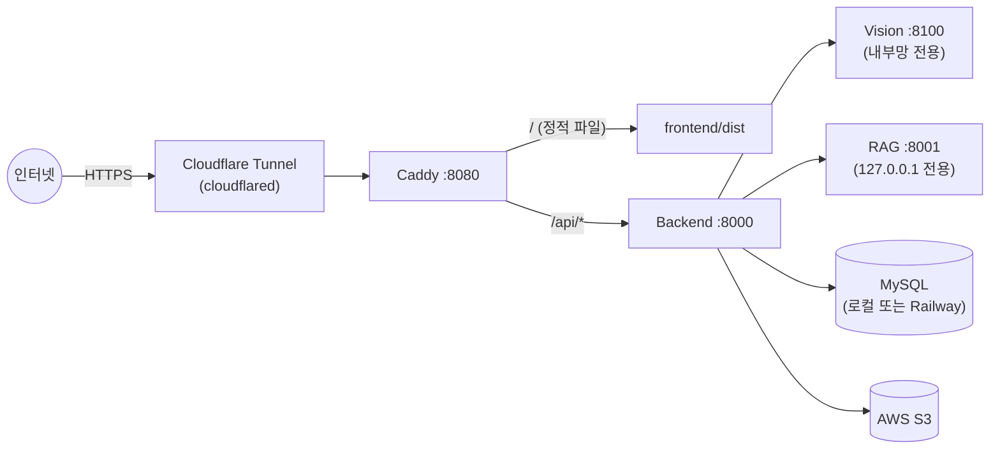

# 배포 가이드

**기준일** 2026-09-29

> 이 문서는 **저장소를 처음 clone한 사람이 처음부터 끝까지 따라 하면 배포까지 끝나는 것**을
> 목표로 합니다. 클라우드 서버를 빌리지 않고 **개인 PC를 서버로 사용하는 경우**(Caddy 리버스
> 프록시 + Cloudflare Tunnel로 외부 노출)를 기준으로 작성했고, Dockerfile/CI 파이프라인 같은
> 자동화는 아직 없어서(§9) 전 과정이 수동 절차입니다. 모든 명령/설정은 실제로 이 저장소에서
> 검증된 것만 실었습니다.

---

## 목차

1. [배포 대상 개요](#1-배포-대상-개요)
2. [사전 준비물](#2-사전-준비물)
3. [배포 절차 (처음부터 끝까지)](#3-배포-절차-처음부터-끝까지)
4. [로컬 MySQL 서버 사용하기](#4-로컬-mysql-서버-사용하기)
5. [Caddy + Cloudflare Tunnel로 외부 공개하기](#5-caddy--cloudflare-tunnel로-외부-공개하기)
6. [YOLO 체크포인트 배포](#6-yolo-체크포인트-배포)
7. [환경별 차이](#7-환경별-차이)
8. [배포 관련 트러블슈팅](#8-배포-관련-트러블슈팅)
9. [향후 과제 (자동화)](#9-향후-과제-자동화)
10. [참고](#10-참고)

---

## 1. 배포 대상 개요

| 프로세스 | 역할 | 기본 포트 | 외부 노출 |
|---|---|---|---|
| Frontend | React 정적 빌드(Vite) | `frontend/dist` (Caddy가 서빙) | **공개** |
| Backend | FastAPI 공개 API | `:8000` | **공개**(Caddy 뒤) |
| Vision | FastAPI + YOLO | `:8100` | **비공개**(Backend만 접근) |
| RAG | FastAPI + LangGraph | `:8001` | **비공개**(`127.0.0.1` 바인딩, Backend만 접근) |
| Caddy | 리버스 프록시 + 정적 파일 서버 | `:8080` | 터널이 이 포트만 외부로 연결 |
| Cloudflare Tunnel | 외부 노출(포트포워딩 불필요) | — | 인터넷 ↔ Caddy(:8080) 연결 |



포트포워딩이나 고정 IP가 전혀 필요 없습니다 — Cloudflare Tunnel이 사설 PC에서 바깥으로 연결을
먼저 열고, 인터넷 요청은 그 터널을 타고 들어옵니다. 라우터 설정을 건드릴 필요가 없습니다.

Vision/RAG는 Caddy가 **아예 라우팅하지 않으므로** 터널을 통해서도 외부에서 접근할 방법이
없습니다 — 오직 Backend가 내부적으로만 호출합니다.

---

## 2. 사전 준비물

| 항목 | 비고 |
|---|---|
| Python 3.13.15 | `.python-version`에 고정. `uv`가 자동으로 이 버전을 사용 |
| [uv](https://docs.astral.sh/uv/) ≥ 0.12.9, < 0.13 | `uv.lock`에 명시된 범위 |
| Node.js | 버전 고정 파일 없음 — LTS 최신 버전 권장 |
| MySQL 8.0 | **로컬 설치**(§4) 또는 Railway 등 원격 인스턴스 |
| AWS S3 버킷 | 분석 이미지 저장용 (없으면 `STORAGE_BACKEND=local`로 로컬 디스크 우회 가능) |
| YOLO 체크포인트 | `weights/best.pt` — §6 참고 |
| Caddy + cloudflared 실행 파일 | 이 저장소의 [`docs/deployment/caddy.zip`](caddy.zip)에 포함(Windows용, `caddy.exe`+`cloudflared.exe`+`Caddyfile`). 다른 OS는 §5.1 공식 링크 참고 |
| (선택) 행정안전부 공공데이터 API 키 | 없으면 배출요일 기능만 degrade |
| (선택) Google Gemini API 키 | RAG 서비스의 재분류/채팅 답변 생성에 필요 |
| Upstage / Pinecone API 키 | RAG 서비스의 임베딩/벡터 검색에 필요 |

---

## 3. 배포 절차 (처음부터 끝까지)

### 3.1 저장소 clone + 의존성 설치

```bash
git clone https://github.com/<org>/recycling_ssg.git
cd recycling_ssg
uv sync --all-packages   # 반드시 --all-packages — backend workspace 멤버 의존성까지 포함
cd frontend && npm install && cd ..
```

### 3.2 환경변수 파일 구성

루트에 `.env`를 만들고(`.env.example` 참고), 최소한 아래 값을 채웁니다.

| 변수 | 설명 |
|---|---|
| `DATABASE_URL` | MySQL 연결 문자열. 로컬 MySQL을 쓸 거라면 §4를 먼저 끝내고 여기로 돌아오세요 |
| `JWT_SECRET_KEY` | 32바이트 이상 무작위 문자열 |
| `AWS_ACCESS_KEY_ID` / `AWS_SECRET_ACCESS_KEY` / `AWS_S3_BUCKET` | 없으면 `STORAGE_BACKEND=local`로 우회 |
| `VISION_SERVER_BASE_URL` | 기본값 `http://127.0.0.1:8100/internal/v1` (그대로 두면 됨) |
| `RAG_SERVICE_URL` 등 | 기본값 `http://localhost:8001/...` (그대로 두면 됨) |
| `UPSTAGE_API_KEY`, `PINECONE_API_KEY` | RAG 임베딩/벡터검색 |
| `GOOGLE_API_KEY`(또는 `GEMINI_API_KEY`) | RAG 재분류/챗봇 |

`vision/.env`도 `vision/.env.example`을 복사해서 만들고, 실제 체크포인트를 가리키도록
`MODEL_PATH`를 확인하세요(§6).

> ⚠️ **`MODEL_VERSION`은 `vision/.env`에서만 수동으로 관리하세요.** OS 환경변수로 export하면
> pydantic-settings가 그 값을 `.env`보다 우선시켜서 엉뚱한 값(`.` 등)으로 덮어써집니다.
> 자세한 내용은 §8 표 참고.

### 3.3 DB 준비

- **로컬 PC를 DB 서버로도 쓴다면** → §4로 가서 MySQL 설치·계정 생성·(선택)기존 데이터 이전을
  끝내고 돌아오세요.
- **Railway 등 이미 떠 있는 원격 MySQL을 그대로 쓴다면** → `DATABASE_URL`만 채우면 됩니다.
  `AUTO_CREATE_TABLES=true`/`AUTO_SEED_MASTER_DATA=true`(기본값, `scripts/run-dev.*`가 설정)
  덕분에 첫 기동 시 테이블 생성과 `regions`(56)/`waste_classes`(17) 시드가 자동으로 됩니다.

### 3.4 벡터DB 초기화 (RAG, 최초 1회만)

```bash
uv run python -m rag.src.ingestion.ingest
```

`rag/data/metadata/*.json`을 임베딩해 Pinecone 인덱스(`recycling-ssg`)에 업서트합니다. 인덱스가
이미 구성되어 있다면(=누군가 이미 한 번 했다면) 재실행할 필요 없습니다.

### 3.5 서버 기동

```bash
# 1) RAG 서비스 (Backend/Vision보다 먼저 기동 권장 — run-dev 스크립트 대상이 아니라 별도 기동 필요)
uv run uvicorn rag.main:app --host 127.0.0.1 --port 8001

# 2) Vision + Backend (체크포인트 자동 탐색 포함)
bash scripts/run-dev.sh          # 또는 .\scripts\run-dev.ps1 (PowerShell)

# 3) (선택, 강력 권장) RAG 규칙 조회 캐시 예열 — 첫 요청 지연/일시적 API 429 방지
uv run python scripts/warm_rule_cache.py --workers 2

# 4) Frontend 정적 빌드 → frontend/dist 생성 (Caddy가 이 폴더를 그대로 서빙)
cd frontend && npm run build && cd ..
```

> `frontend/dist/`는 빌드 결과물이라 `.gitignore`로 제외되어 있습니다. clone 직후에는 없으므로
> **반드시 직접 빌드**해야 하고, 프론트엔드 코드가 바뀔 때마다(브랜치 merge/pull 후 포함) 다시
> 빌드해야 화면에 반영됩니다. 배포에서는 `npm run dev`(개발 서버, :8443)를 쓰지 않습니다.

### 3.6 헬스체크

```bash
curl http://127.0.0.1:8000/health   # Backend
curl http://127.0.0.1:8000/ready    # Backend + DB 연결 확인
curl http://127.0.0.1:8100/health   # Vision (model_loaded:true 확인)
curl http://127.0.0.1:8001/health   # RAG
```

넷 다 정상이면 여기까지는 `localhost`에서만 도는 상태입니다. 외부에 공개하려면 §5로 이어집니다.

### 3.7 Caddy + 터널로 외부 공개

§5 전체를 따라 하세요. 끝나면 Cloudflare가 발급한 URL로 외부에서 접속됩니다.

### 3.8 배포 검증

```bash
bash scripts/smoke-test.sh   # 19개 API 그룹, 100건 검사
```

> smoke test는 실제 DB에 `smoke-…@example.com` 테스트 계정과 분석/피드백 기록을 남기고,
> 분석 이미지를 스토리지(S3)에 올립니다.

### 3.9 서버 가동 체크리스트 (재부팅 후 매번)

최초 설치(§3.1~3.4, §4, §5.1~5.2)가 끝난 PC에서, 재부팅 등으로 서비스를 다시 띄울 때의
순서입니다. **프로세스 6개 + 캐시 예열 1단계**이며, 각각 별도 터미널에서 실행합니다
(저장소 루트 기준).

| # | 대상 | 명령 | 확인 |
|---|---|---|---|
| 1 | MySQL (:3306) | `net start MySQL80` (관리자 권한, 자동 시작이면 생략) | `Get-Service MySQL80` → Running |
| 2 | RAG (:8001) | `uv run uvicorn rag.main:app --host 127.0.0.1 --port 8001` | `curl http://127.0.0.1:8001/health` |
| 3·4 | Vision (:8100) + Backend (:8000) | `bash scripts/run-dev.sh` (로그: `.dev-logs/`) | `curl http://127.0.0.1:8000/ready`, `curl http://127.0.0.1:8100/health` |
| 5 | RAG 캐시 예열 | `uv run python scripts/warm_rule_cache.py --workers 2` | `curl http://127.0.0.1:8001/cache_info`의 `currsize` > 0 |
| 6 | Caddy (:8080) | `C:\caddy\caddy.exe run --config C:\caddy\Caddyfile` | `curl http://127.0.0.1:8080/` → 200 (index.html) |
| 7 | Cloudflare Tunnel | `C:\caddy\cloudflared.exe tunnel --url http://localhost:8080` | 콘솔에 출력된 `https://….trycloudflare.com` 접속 |

- 6번 전에 `frontend/dist`가 있어야 합니다(§3.5의 4번). 코드를 받은 뒤라면 다시 빌드하세요.
- 서버가 이 저장소의 **작업 폴더 코드를 그대로 실행**하므로, 브랜치 전환·merge·pull 즉시 운영
  코드가 바뀝니다. 그 뒤에는 3·4번을 재시작하고 프론트엔드를 다시 빌드하세요.
- 7번(Quick Tunnel)은 실행할 때마다 URL이 바뀝니다. 고정 URL은 §5.4.2.

---

## 4. 로컬 MySQL 서버 사용하기

원격 DB(Railway 등) 없이 지금 이 PC를 DB 서버로도 쓰고 싶을 때의 절차입니다.

### 4.1 설치

[MySQL Installer for Windows](https://dev.mysql.com/downloads/installer/)로 **MySQL Server 8.0**을
설치합니다. 설치 마법사에서 "Standalone MySQL Server"를 선택하면 Windows 서비스(`MySQL80`,
시작 유형 **자동**)로 등록됩니다.

설치 확인:

```powershell
Get-Service MySQL80
```

`Running`이 아니면:

```powershell
Start-Service MySQL80   # 반드시 관리자 권한 PowerShell에서
```

### 4.2 앱 전용 계정 + DB 생성

root(설치 시 설정한 비밀번호)로 접속해서, 앱이 쓸 별도 계정을 만듭니다(운영 앱이 root를 직접
쓰지 않도록):

```sql
CREATE DATABASE recycling_ssg CHARACTER SET utf8mb4 COLLATE utf8mb4_unicode_ci;
CREATE USER 'app_user'@'localhost' IDENTIFIED BY '<강력한-비밀번호>';
GRANT ALL PRIVILEGES ON recycling_ssg.* TO 'app_user'@'localhost';
FLUSH PRIVILEGES;
```

### 4.3 `.env` 연결

```
DATABASE_URL=mysql+pymysql://app_user:<비밀번호>@localhost:3306/recycling_ssg?charset=utf8mb4
```

이제 `scripts/run-dev.*`로 Backend를 기동하면 `AUTO_CREATE_TABLES`/`AUTO_SEED_MASTER_DATA`가
테이블 생성 + `regions`(56)/`waste_classes`(17) 시드까지 자동으로 끝냅니다. 여기서 멈춰도
됩니다 — 아래 §4.4는 **기존에 다른(원격) DB에 실사용자 데이터가 이미 있고, 그걸 로컬로 그대로
옮기고 싶을 때만** 필요합니다.

### 4.4 (선택) 기존 원격 DB 데이터를 로컬로 이전

`mysqldump`로 통째로 옮기는 방법입니다. MySQL Server 설치 폴더의 `bin/`에 `mysqldump.exe`/
`mysql.exe`가 있습니다.

```bash
MYSQLDUMP="/c/Program Files/MySQL/MySQL Server 8.0/bin/mysqldump.exe"
MYSQL="/c/Program Files/MySQL/MySQL Server 8.0/bin/mysql.exe"

# 1) 원격 DB 전체 덤프
"$MYSQLDUMP" -h <원격호스트> -P <포트> -u <계정> -p'<비밀번호>' \
  --single-transaction --no-tablespaces --set-gtid-purged=OFF \
  recycling_ssg > dump.sql

# 2) 로컬에 이미 Backend가 한 번이라도 떠서 만들어놓은 테이블이 있다면 먼저 깨끗이 비우기
#    (안 비우면 아래 3번 복원 중 FK 타입 충돌로 실패할 수 있음 — §8 참고)
"$MYSQL" -h localhost -u app_user -p'<비밀번호>' recycling_ssg -e "
SET FOREIGN_KEY_CHECKS=0;
DROP TABLE IF EXISTS favorites, feedback_candidates, feedback, images, users, waste_classes, regions;
SET FOREIGN_KEY_CHECKS=1;
"

# 3) 로컬로 복원
"$MYSQL" -h localhost -u app_user -p'<비밀번호>' recycling_ssg < dump.sql
```

**검증** — 양쪽 행 개수가 정확히 같은지 테이블별로 대조하세요:

```sql
SELECT 'users', COUNT(*) FROM users
UNION ALL SELECT 'feedback', COUNT(*) FROM feedback
UNION ALL SELECT 'feedback_candidates', COUNT(*) FROM feedback_candidates
UNION ALL SELECT 'images', COUNT(*) FROM images
UNION ALL SELECT 'favorites', COUNT(*) FROM favorites;
```

> `waste_classes`가 17이 아니라 더 많이 나올 수 있습니다 — 정상입니다. 예전 분류 체계(86개)
> 시절 데이터를 참조하는 기존 `feedback` 행이 있으면 그 class_id들은 FK 제약 때문에 지우지
> 못하고 `__legacy_N__`이라는 자리표시자로만 남아있습니다(`backend/db/seed.py` 참고).

---

## 5. Caddy + Cloudflare Tunnel로 외부 공개하기

### 5.1 바이너리 준비

이 저장소의 [`docs/deployment/caddy.zip`](caddy.zip)에 **Windows용** `caddy.exe`,
`cloudflared.exe`, `Caddyfile`이 이미 들어있습니다. 원하는 위치(예: `C:\caddy\`)에 압축을
풀면 바로 씁니다.

다른 OS를 쓰거나 최신 버전이 필요하면 공식 배포판을 받으세요:

- Caddy: https://caddyserver.com/download
- cloudflared: https://github.com/cloudflare/cloudflared/releases

### 5.2 Caddyfile

`caddy.zip`에 들어있는 `Caddyfile` 내용입니다(경로만 본인 환경에 맞게 바꾸면 그대로 동작):

```caddyfile
:8080 {
	encode zstd gzip
	request_body max_size 12MB

	handle /api/* {
		reverse_proxy 127.0.0.1:8000
	}

	handle {
		root * C:/<저장소-clone-경로>/frontend/dist
		try_files {path} /index.html
		file_server
	}
}
```

- `/api/*`는 Backend(`:8000`)로 그대로 흘려보냅니다.
- 그 외 모든 경로는 `frontend/dist`의 정적 파일을 서빙하고, 없는 경로는 `index.html`로
  fallback합니다(SPA 라우팅 지원 — 새로고침해도 404 안 남).
- `root` 경로는 **본인의 실제 clone 경로**로 바꿔야 합니다. Frontend는 §3.5에서 미리
  `npm run build`로 `dist/`를 만들어둬야 합니다.
- Vision(`:8100`)/RAG(`:8001`)로 가는 경로는 **의도적으로 없습니다** — 외부에서 절대 접근할
  수 없습니다.

### 5.3 Caddy 실행

```powershell
cd C:\caddy
.\caddy.exe run
```

정상이면 `http://localhost:8080`에서 Frontend가 뜨고 `/api/...`가 Backend로 프록시됩니다.

### 5.4 외부에 공개하기 — Cloudflare Tunnel

두 가지 방식이 있습니다. **처음 써보거나 그냥 빨리 확인만 하고 싶으면 Quick Tunnel**로
시작하세요.

#### 5.4.1 Quick Tunnel (계정 가입 불필요, 가장 빠름)

```powershell
cd C:\caddy
.\cloudflared.exe tunnel --url http://localhost:8080
```

콘솔에 `https://<무작위단어>.trycloudflare.com` 형태의 URL이 출력됩니다. 그 URL로 바로
접속됩니다. **단, 이 명령을 다시 실행할 때마다(재부팅 포함) URL이 매번 바뀝니다** — 데모/테스트
용도로는 충분하지만, 고정 주소가 필요하면 아래 Named Tunnel로 넘어가세요.

#### 5.4.2 Named Tunnel (고정 URL, 본인 도메인 필요)

Cloudflare에 무료 가입 + 도메인 하나를 Cloudflare 네임서버로 연결해야 합니다.

```powershell
# 1) 로그인 (브라우저가 열리고 Cloudflare 계정으로 인증)
.\cloudflared.exe tunnel login

# 2) 터널 생성 (이름은 원하는 대로)
.\cloudflared.exe tunnel create recycling-ssg

# 3) 이 도메인으로 들어오는 트래픽을 방금 만든 터널로 라우팅(DNS CNAME 자동 등록)
.\cloudflared.exe tunnel route dns recycling-ssg app.example.com

# 4) 설정 파일 작성 (%USERPROFILE%\.cloudflared\config.yml)
```

```yaml
tunnel: recycling-ssg
credentials-file: C:\Users\<사용자명>\.cloudflared\<터널ID>.json

ingress:
  - hostname: app.example.com
    service: http://localhost:8080
  - service: http_status:404
```

```powershell
# 5) 실행
.\cloudflared.exe tunnel run recycling-ssg
```

이제 `https://app.example.com`으로 접속하면 재부팅해도 주소가 바뀌지 않습니다.

### 5.5 (선택) 부팅 시 자동 실행

Windows 작업 스케줄러에 "로그온 시 시작" 트리거로 `caddy.exe run`과
`cloudflared.exe tunnel run recycling-ssg`(또는 Quick Tunnel 명령) 두 작업을 등록해두면,
PC를 재부팅해도 서비스가 자동으로 다시 뜹니다. (`cloudflared`는 `cloudflared service install`
명령으로 아예 Windows 서비스로 등록하는 것도 가능합니다 — Named Tunnel 설정을 마친 뒤 사용하세요.)

---

## 6. YOLO 체크포인트 배포

1. 학습 완료된 체크포인트를 `weights/best.pt`로 복사(또는 `MODEL_PATH` 환경변수로 지정).
2. **`weights/yolo26n.pt`(COCO 사전학습 원본)를 절대 지정하지 말 것** — 17개 폐기물 taxonomy가
   아닌 COCO 클래스 인덱스가 반환되어 `class_id`가 조용히 오염됨.
3. `data/taxonomy/waste_classes.json`의 클래스 수/순서가 체크포인트와 정확히 일치하는지 확인.
4. `vision/.env`의 `MODEL_VERSION`을 새 체크포인트에 맞게 **수동으로** 갱신(§8 표 참고).
5. `vision/tests/test_api_real_model.py`로 실제 추론 계약 검증.

자세한 모델 배경은 [../specifications/13-ai-model-yolo.md](../specifications/13-ai-model-yolo.md)를 참고하세요.

---

## 7. 환경별 차이

| 환경 | `STORAGE_BACKEND` | `DATABASE_URL` | 비고 |
|---|---|---|---|
| 로컬 개발(기본) | `s3`(운영과 동일) | Railway 등 원격 | `scripts/run-dev.*`가 자동 설정 |
| 로컬 개발(AWS 자격증명 없음) | `local` | 원격 또는 로컬 | `.local_storage/`에 저장 |
| PC를 서버로(개인 배포) | `s3` 또는 `local` | **로컬 MySQL**(§4) | Caddy+터널로 외부 공개(§5) |
| 운영(클라우드) | `s3` | Railway MySQL | — |

---

## 8. 배포 관련 트러블슈팅

| 증상 | 원인 / 해결 |
|---|---|
| Backend가 `Can't connect to MySQL server on 'localhost'`로 즉시 죽음 | `.env`의 `DATABASE_URL`이 로컬을 가리키는데 로컬 MySQL 서비스(`MySQL80`)가 꺼져 있음 — `Get-Service MySQL80`으로 확인 후 `Start-Service MySQL80`(관리자 권한) |
| `Start-Service MySQL80`이 `Cannot open MySQL80 service`로 실패 | 관리자 권한이 아닌 PowerShell/터미널에서 실행함 — 관리자 권한으로 다시 실행 |
| 관리자 권한으로 서비스를 껐다 켜도 `The innodb_system data file 'ibdata1' must be writable`로 계속 실패 | **좀비 `mysqld.exe` 프로세스**가 서비스와 별개로 남아 `ibdata1`을 잠그고 있는 경우가 있음. `tasklist \| findstr mysqld`로 확인 → 관리자 권한 작업 관리자에서 전부 종료 → 그래도 "액세스 거부"가 뜨면 컴퓨터 재부팅(서비스가 자동 시작으로 등록돼 있으면 재부팅 후 깨끗하게 다시 뜸) |
| 관리자 권한으로 `taskkill`을 했는데도 "액세스가 거부되었습니다" | 관리자 권한 터미널이 아니거나(작업 관리자를 "관리자 권한으로 실행"했는지 재확인), 보안 소프트웨어가 프로세스 종료 자체를 막고 있을 수 있음 — 재부팅이 가장 확실한 해결책 |
| `pytest`/특정 실행 파일이 `애플리케이션 제어 정책에서 이 파일을 차단했습니다`로 실행 안 됨 | Windows 애플리케이션 제어 정책이 특정 `.exe`를 직접 spawn하는 걸 차단하는 경우가 있음 — `pytest ...` 대신 `python -m pytest ...`처럼 **모듈로 실행**하면 우회됨 |
| `mysqldump` 복원 중 `Referencing column 'class_id' ... are incompatible`(오류 3780) | 로컬에 SQLAlchemy가 이미 만들어놓은 테이블(예: `waste_classes.class_id`가 `INT`)과 복원하려는 덤프(`INT UNSIGNED`)의 타입이 안 맞아서 생김 — 복원 전에 로컬 테이블을 전부 `DROP`하고 빈 스키마에 복원(§4.4 2번 단계) |
| Railway↔로컬 데이터 이전 후 `waste_classes`가 86개로 보임 | 버그 아님 — 예전 86개 분류 체계 시절 데이터를 참조하는 `feedback` 행이 있어 그 class_id들이 FK 제약 때문에 삭제되지 못하고 `__legacy_N__`으로만 비워진 것(§4.4 하단 노트, `backend/db/seed.py` 참고) |
| `MODEL_VERSION`이 실제와 다르게(`.` 등) 표시됨 | OS 환경변수로 `MODEL_VERSION`을 export하면 `vision/.env`보다 **우선순위가 높아** 잘못된 값이 이김(pydantic-settings 우선순위 규칙) — OS 환경변수로는 절대 설정하지 말고 `vision/.env`에서만 관리 |
| `scripts/run-dev.sh` 기동이 눈에 띄게 느림(Vision 쪽) | `--reload`에 `--reload-dir`을 안 주면 uvicorn이 저장소 루트 전체(`data/`, `ai/` 등 10만+ 파일)를 감시함 — 현재 스크립트는 `--reload-dir vision --reload-dir data/taxonomy`로 좁혀둠. 직접 다른 스크립트를 짤 때도 이 패턴 유지 권장 |
| `/analyze`의 `warnings`에 `RAG_SERVICE_UNAVAILABLE` | RAG 서비스(:8001)가 안 떠 있음 — §3.5의 1번 단계 확인 |
| RAG `/rule_node` 호출이 간헐적으로 500(`openai.RateLimitError: 429`) | Upstage 임베딩 API의 초당/분당 요청 제한. `rule_lookup.py`의 in-process 캐시(`lru_cache`)가 있어서, 실패한 조합만 다시 계산됨 — `scripts/warm_rule_cache.py --workers 2`처럼 **동시성을 낮춰 재실행**하면 대부분 해결됨. 이미 캐시된 조합은 재실행 시 즉시(수 ms) 스킵되므로 재실행 비용은 낮음 |
| Caddy는 떴는데 브라우저에서 빈 화면/404 | `frontend/dist`가 없음 — `cd frontend && npm run build`를 먼저 실행했는지, `Caddyfile`의 `root` 경로가 실제 clone 위치와 일치하는지 확인 |
| 터널 URL은 열리는데 로그인/분석 등 `/api/...` 요청만 실패 | Backend(:8000)가 안 떠 있거나 Caddy가 `/api/*`를 8000이 아닌 다른 포트로 잘못 프록시 중 — `curl http://127.0.0.1:8000/health`로 Backend 자체가 살아있는지 먼저 확인 |
| Cloudflare Quick Tunnel URL이 재부팅마다 바뀜 | Quick Tunnel의 정상 동작 — 고정 주소가 필요하면 §5.4.2 Named Tunnel로 전환 |
| 코드를 고쳤는데 Backend/Vision 응답이 그대로임 (로그에 `WatchFiles detected changes ... Reloading...`만 찍힘) | Windows에서 uvicorn `--reload`가 이전 worker를 종료하지 못하고 계속 응답하는 경우가 있음 — `run-dev.*`로 다시 기동(또는 8000/8100 프로세스 종료 후 재기동) |
| 서버 재시작 후 이전 모델/코드 버전으로 계속 응답 | 8000/8100 포트에 이전 프로세스가 남아있음 — `run-dev.*`는 기동 전 정리하지만 수동 배포 시엔 `netstat -ano`로 PID 찾아 직접 종료 필요 |

---

## 9. 향후 과제 (자동화)

- Dockerfile/`docker-compose.yml` 작성(Backend/Vision/RAG/Frontend 4개 서비스 + MySQL은 컨테이너화,
  Pinecone은 관리형 유지)
- CI 파이프라인(GitHub Actions) — `pytest`, `npm run build`, `scripts/smoke-test.sh` 자동 실행
- 배포 자동화 스크립트에 RAG 서비스 + Caddy + 터널 기동을 통합(현재는 각각 수동 기동, `run-dev.*`
  대상 밖)
- Cloudflare Named Tunnel의 `config.yml`/자격증명 발급을 스크립트화

---

## 10. 참고

- 서비스 아키텍처: [../specifications/09-service-architecture.md](../specifications/09-service-architecture.md)
- 환경변수 전체 목록: [`docs/DEVELOPMENT.md`](../DEVELOPMENT.md#환경-변수)
- DB 스키마/시딩 로직: [`../DATABASE_SCHEMA.md`](../DATABASE_SCHEMA.md)
- 트러블슈팅(환경/실행/RAG/Known Issues): [../troubleshooting/README.md](../troubleshooting/README.md)
