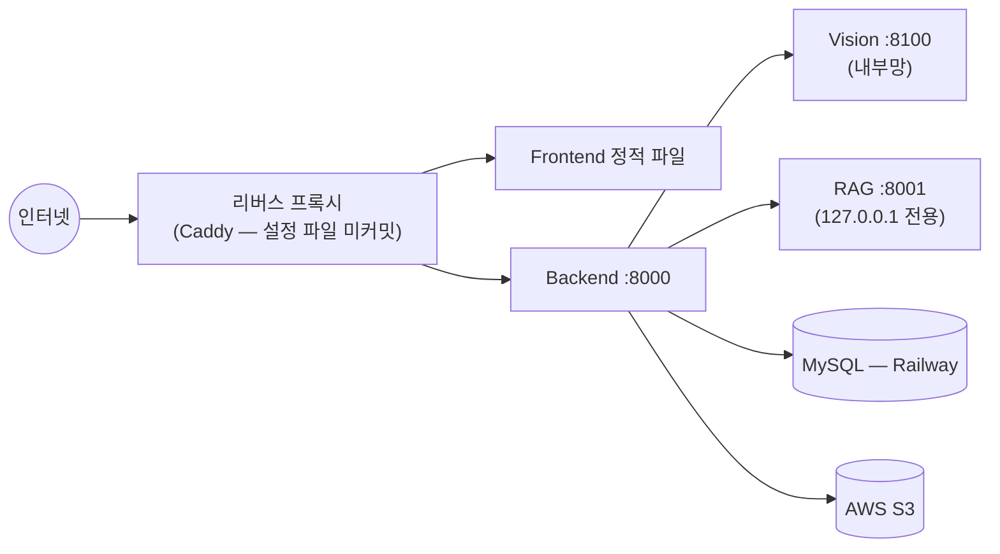

# 배포 가이드

**기준일** 2026-09-28

> **현재 상태**: 이 저장소에는 Dockerfile, docker-compose, CI/CD 파이프라인(GitHub Actions 등),
> Railway/Vercel/Render 같은 플랫폼 설정 파일이 **존재하지 않습니다**. 배포는 현재 수동
> 절차(uv/npm 스크립트 + 환경변수)로 이루어집니다. 이 문서는 실제 코드에 남아있는 단서
> (환경변수, 실행 스크립트, 코드 주석)를 근거로 "현재 어떻게 배포되고 있는가"와 "수동으로
> 배포하려면 무엇이 필요한가"를 정리합니다. 자동화(Docker화, CI/CD 구성)는 향후 과제입니다.

---

## 1. 배포 대상 — 4개 프로세스

| 프로세스 | 역할 | 기본 포트 | 외부 노출 |
|---|---|---|---|
| Frontend | React 정적 빌드(Vite) | `:8443`(또는 `:5173`) | **공개** |
| Backend | FastAPI 공개 API | `:8000` | **공개**(리버스 프록시 뒤) |
| Vision | FastAPI + YOLO | `:8100` | **비공개**(Backend만 접근) |
| RAG | FastAPI + LangGraph | `:8001` | **비공개**(`127.0.0.1` 바인딩, Backend만 접근) |

코드 주석(`rag/main.py`)에 따르면 운영 환경은 **Caddy**를 리버스 프록시로 사용하며, RAG 서비스는
Caddy가 프록시하지 않아 외부에서 접근 불가능한 상태로 유지됩니다. 다만 Caddy 설정 파일 자체는
이 저장소에 커밋되어 있지 않습니다.



---

## 2. 사전 준비물

| 항목 | 비고 |
|---|---|
| Python 3.13.15 | `.python-version`에 고정. `uv`가 이 버전을 자동으로 사용 |
| [uv](https://docs.astral.sh/uv/) ≥ 0.12.9, < 0.13 | `uv.lock`에 명시된 범위. Python workspace 패키지 관리자 |
| Node.js | 버전 고정 파일 없음(`.nvmrc` 등 부재) — LTS 최신 버전 권장 |
| MySQL 8.0 인스턴스 | 운영은 Railway 호스팅 사용 중(`DATABASE_URL`로 연결) |
| AWS S3 버킷 | 분석 이미지 저장용 |
| YOLO 체크포인트 | `weights/best.pt` — §5 참고 |
| (선택) 행정안전부 공공데이터 API 키 | 없으면 배출요일 기능만 degrade |
| (선택) Google Gemini API 키 | RAG 서비스의 재분류/채팅 답변 생성에 필요 |
| Upstage / Pinecone API 키 | RAG 서비스의 임베딩/벡터 검색에 필요(`.env`의 `UPSTAGE_API_KEY`, `PINECONE_API_KEY`) |

---

## 3. 배포 절차 (수동)

### 3.1 의존성 설치

```bash
uv sync --all-packages   # 반드시 --all-packages — backend workspace 멤버 의존성 포함
cd frontend && npm install
```

### 3.2 환경변수 파일 구성

| 파일 | 대상 | 필수 항목 |
|---|---|---|
| `.env` (루트) | Backend | `DATABASE_URL`, `JWT_SECRET_KEY`, `AWS_*`, `VISION_SERVER_BASE_URL`, `RAG_SERVICE_URL`/`RAG_CHAT_URL`/`RAG_RECLASSIFY_URL` |
| `vision/.env` | Vision | `MODEL_PATH` |
| (RAG 서비스는 루트 `.env`를 함께 사용) | RAG | `UPSTAGE_API_KEY`, `PINECONE_API_KEY`, `GOOGLE_API_KEY`(또는 `GEMINI_API_KEY`), `NVIDIA_API_KEY` |

전체 환경변수 설명은 [`docs/API_SPEC.md`](../API_SPEC.md) §1 및 루트 [`README.md`](../../README.md) §환경변수를 참고하세요.

### 3.3 벡터DB 초기화 (RAG, 최초 1회)

```bash
uv run python -m rag.src.ingestion.ingest
```

`rag/data/metadata/*.json`을 임베딩해 Pinecone 인덱스(`recycling-ssg`)에 업서트합니다. 이미 인덱스가
구성되어 있다면 재실행할 필요는 없습니다.

### 3.4 서버 기동 순서

RAG는 자동 기동 스크립트 대상이 **아니므로 반드시 별도로 먼저(또는 함께) 기동**해야
`/analyze`, `/chat`, `/not-in-list`가 정상 동작합니다.

```bash
# 1) RAG 서비스 (Backend/Vision보다 먼저 기동 권장)
uv run uvicorn rag.main:app --host 127.0.0.1 --port 8001

# 2) Vision + Backend (체크포인트 자동 탐색 포함)
bash scripts/run-dev.sh          # 또는 .\scripts\run-dev.ps1 (PowerShell)

# 3) (선택) 캐시 예열 — 첫 요청 지연 방지
uv run python scripts/warm_rule_cache.py

# 4) Frontend
cd frontend && npm run build && npm run preview   # 또는 정적 파일을 리버스 프록시에 서빙
```

### 3.5 헬스체크로 기동 확인

```bash
curl http://127.0.0.1:8000/health   # Backend
curl http://127.0.0.1:8000/ready    # Backend + DB
curl http://127.0.0.1:8100/health   # Vision (model_loaded:true 확인)
curl http://127.0.0.1:8001/health   # RAG
```

### 3.6 배포 검증

```bash
bash scripts/smoke-test.sh   # 19개 API 그룹, 100건 검사
```

---

## 4. YOLO 체크포인트 배포

1. 학습 완료된 체크포인트를 `weights/best.pt`로 복사(또는 `MODEL_PATH` 환경변수로 지정).
2. **`weights/yolo26n.pt`(COCO 사전학습 원본)를 절대 지정하지 말 것** — 17개 폐기물 taxonomy가
   아닌 COCO 클래스 인덱스가 반환되어 `class_id`가 조용히 오염됨.
3. `data/taxonomy/waste_classes.json`의 클래스 수/순서가 체크포인트와 정확히 일치하는지 확인.
4. `vision/tests/test_api_real_model.py`로 실제 추론 계약 검증.

자세한 모델 배경은 [../specifications/13-ai-model-yolo.md](../specifications/13-ai-model-yolo.md)를 참고하세요.

---

## 5. 환경별 차이

| 환경 | `STORAGE_BACKEND` | 비고 |
|---|---|---|
| 로컬 개발(기본) | `s3`(운영과 동일하게 실제 S3 사용) | `scripts/run-dev.*`가 자동 설정 |
| 로컬 개발(AWS 자격증명 없음) | `local` | `.local_storage/`에 저장, `s3_key` 의미는 동일 |
| 운영 | `s3` | Railway MySQL + AWS S3 |

---

## 6. 배포 관련 트러블슈팅

| 증상 | 원인 / 해결 |
|---|---|
| 재기동 후에도 이전 모델 버전으로 응답 | 8000/8100 포트에 이전 프로세스가 남아있음 — `scripts/run-dev.*`는 기동 전 해당 포트를 정리하지만, 수동 배포 시에는 직접 `kill` 필요 |
| `MODEL_VERSION`이 실제와 다르게 표시됨 | OS 환경변수로 `MODEL_VERSION`을 export하면 `vision/.env`보다 **우선순위가 높아** 잘못된 라벨이 표시될 수 있음(pydantic-settings 우선순위) — OS 환경변수로는 설정하지 말 것 |
| 배포 스크립트에 JWT 시크릿이 하드코딩되는 사고 재발 방지 | `scripts/run-dev.*`는 `DATABASE_URL`/`JWT_SECRET_KEY`를 스크립트 시작 시 명시적으로 `unset`하여, 루트 `.env` 값이 항상 우선하도록 강제함 — 새 배포 스크립트 작성 시 이 패턴 유지 권장 |
| RAG 서비스가 외부에서 접근됨(보안 사고) | RAG는 반드시 `127.0.0.1` 바인딩 + 리버스 프록시 미노출로 운영할 것(§1) |

---

## 7. 향후 과제 (자동화)

- Dockerfile/`docker-compose.yml` 작성(Backend/Vision/RAG/Frontend 4개 서비스 + MySQL/Pinecone은 관리형 유지)
- CI 파이프라인(GitHub Actions) — `pytest`(104+24), `npm run build`, `scripts/smoke-test.sh` 자동 실행
- Caddy 등 리버스 프록시 설정 파일을 저장소에 포함해 배포 재현성 확보
- 배포 자동화 스크립트에 RAG 서비스 기동을 포함(현재는 `run-dev.*` 대상 밖)

---

## 8. 참고

- 서비스 아키텍처: [../specifications/09-service-architecture.md](../specifications/09-service-architecture.md)
- 환경변수 전체 목록: [`../../README.md`](../../README.md#환경-변수)
- 트러블슈팅(환경/실행): [../troubleshooting/README.md](../troubleshooting/README.md)
