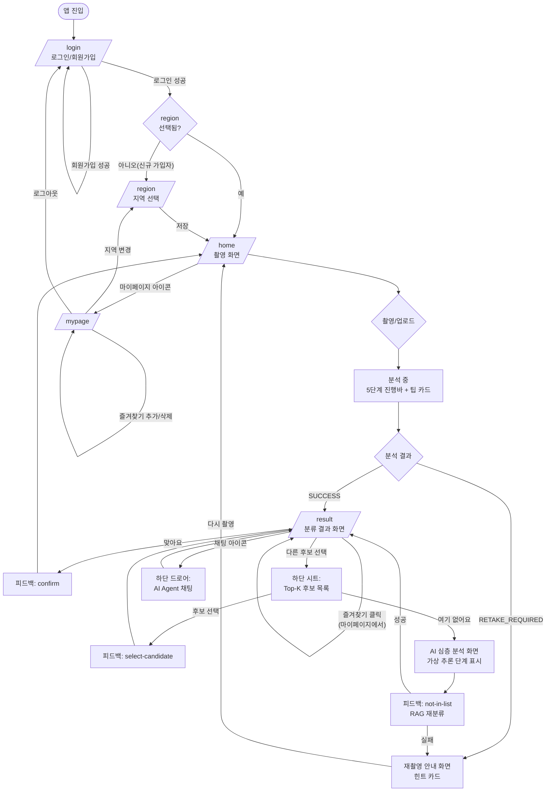
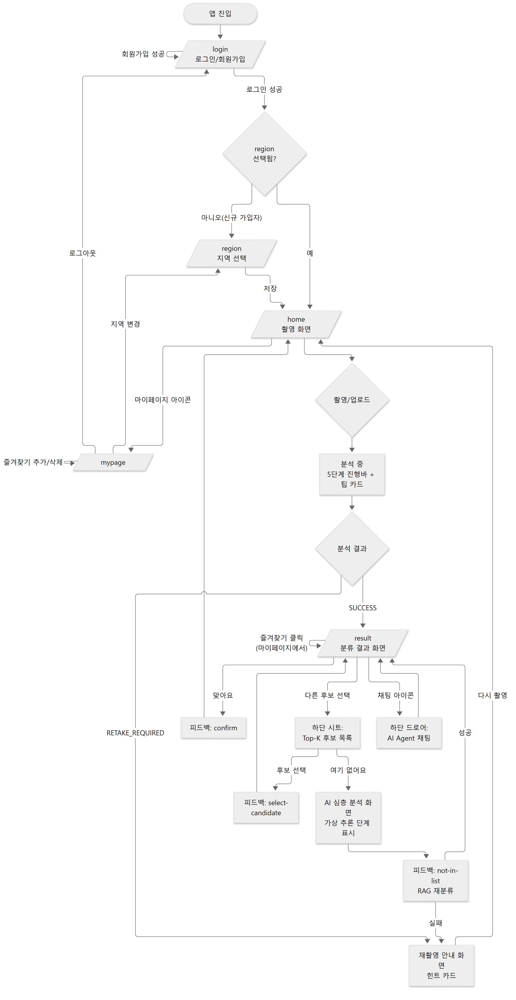
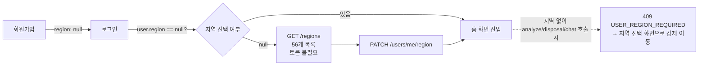
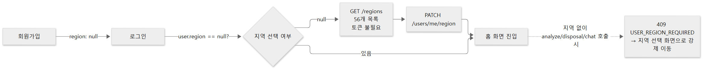
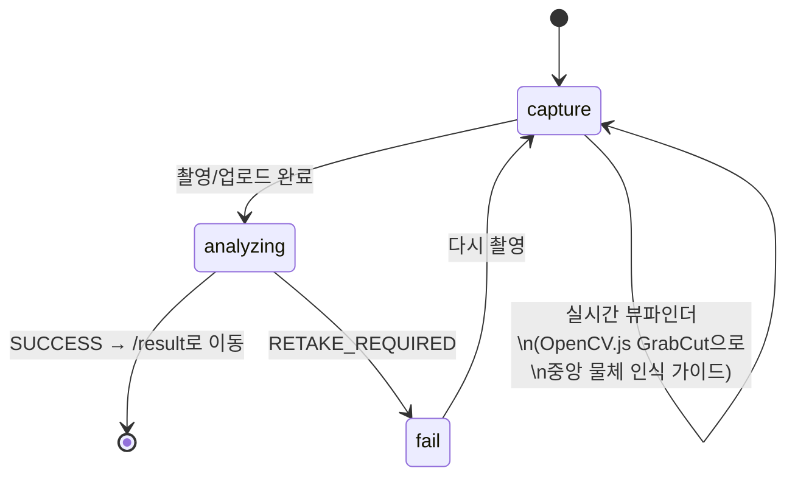

# 사용자 흐름도 (User Flow)

**버전** v1.0 · **기준일** 2026-09-28 · **기준** `frontend/src` 실제 라우팅/화면 구조

---

## 1. 화면(라우트) 목록

| 경로 | 화면 컴포넌트 | 설명 |
|---|---|---|
| `/login` | `AuthScreen` | 로그인/회원가입 (탭 전환) |
| `/region` | `RegionScreen` | 시/도 → 시/군/구 선택 |
| `/home`, `/capture` | `PhotoCaptureScreen` | 카메라 촬영/이미지 업로드 + 분석 요청 (동일 컴포넌트) |
| `/result` | `ResultScreen` | 분류 결과, 피드백, AI 채팅 드로어 |
| `/mypage` | `MyPageScreen` | 프로필, 지역 변경, 즐겨찾기 |

> **현재 코드 상태 참고**: 라우트 가드 컴포넌트(`RequireAuth`, `RootRedirect`)가 구현되어 있지만
> `App.tsx`에서 실제로는 비활성화(주석 처리)되어 있어, 로그인 없이도 URL로 각 화면에 직접
> 진입할 수 있습니다. 각 화면이 `if (!user) return null`로 자체 방어만 하는 상태로, 이 흐름도는
> **의도된 정상 흐름** 기준으로 작성했습니다. 자세한 내용은
> [../troubleshooting/README.md](../troubleshooting/README.md)에 기록합니다.

---

## 2. 전체 흐름도

---

## 3. 필수 선행 조건 흐름 — 지역 선택

회원가입은 지역을 받지 않으므로(`region: null` 고정), **지역 선택은 로그인 직후 반드시 거쳐야 하는
관문**입니다. 이를 생략하면 분석/배출정보/채팅 API가 전부 409로 막힙니다.

---

## 4. 촬영 화면(`PhotoCaptureScreen`) 내부 상태 전이

- `capture`: 라이브 카메라 뷰파인더가 화면 중앙 가이드 프레임 안의 물체를 실시간으로 인식해
  "너무 멀어요 / 가까워요 / 인식됐어요" 안내를 표시합니다(`getUserMedia` 실패 시 OS 카메라 앱으로 대체).
- `analyzing`: 실제 응답 시간과 무관하게 최소 3초(`MIN_ANALYZING_MS`) 동안 진행바를 보여줘 화면이
  깜빡이지 않게 합니다.
- `fail`: 실패 유형별 힌트(흐림/어두움/다중 객체/불분명)를 안내하지만, 현재는 백엔드가 세부 사유를
  내려주지 않아 대부분 "불분명" 기본값으로 표시됩니다.

---

## 5. 참고

- 처리 로직의 세부 분기: [07-flowchart.md](07-flowchart.md)
- 화면별 상세 동작: [05-functional-specification.md](05-functional-specification.md)
- 페르소나 기반 시나리오: [03-user-scenarios.md](03-user-scenarios.md)
