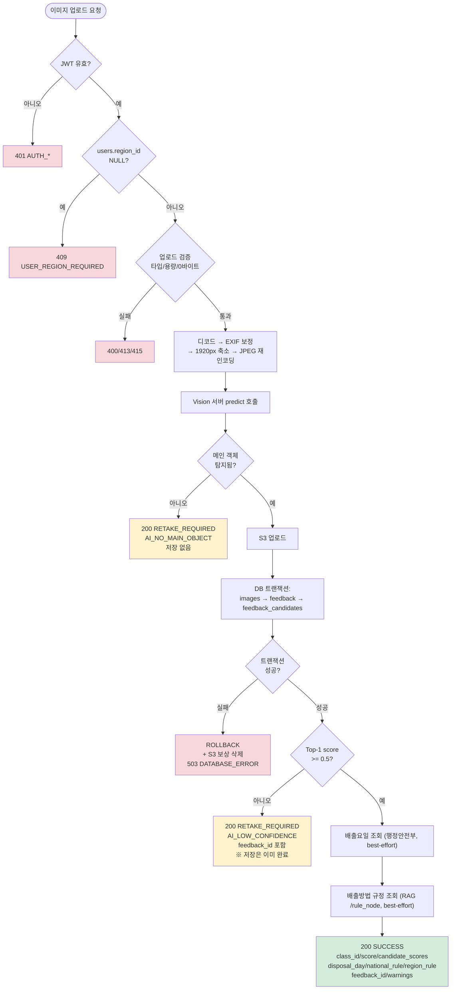
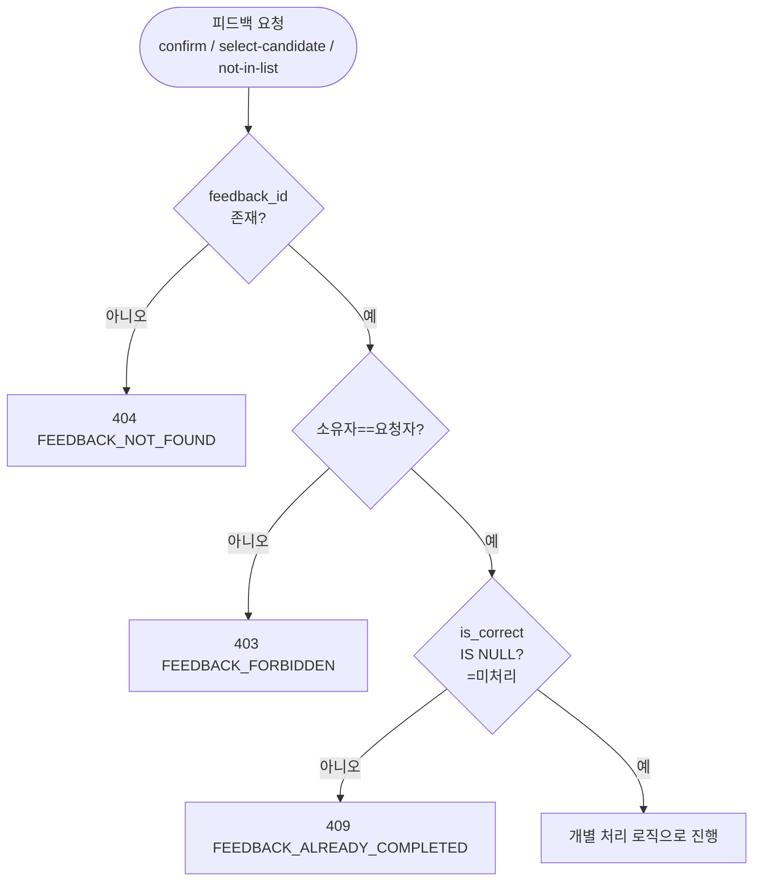
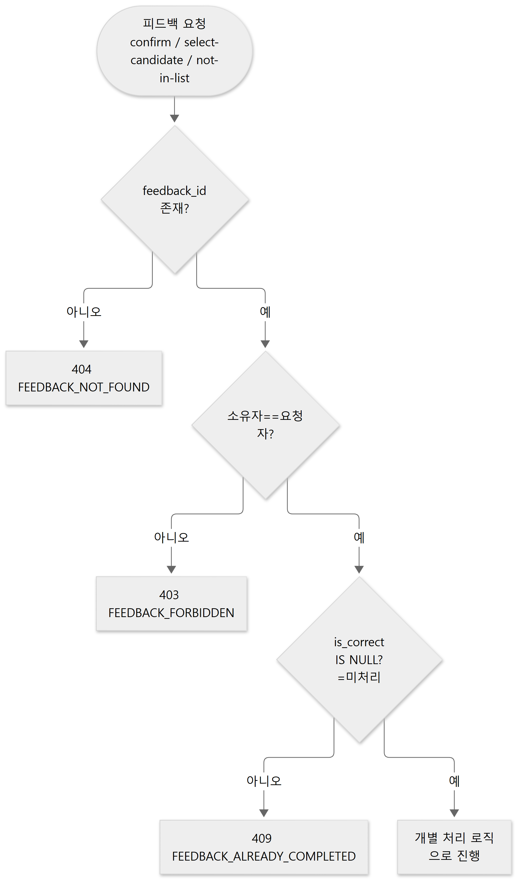
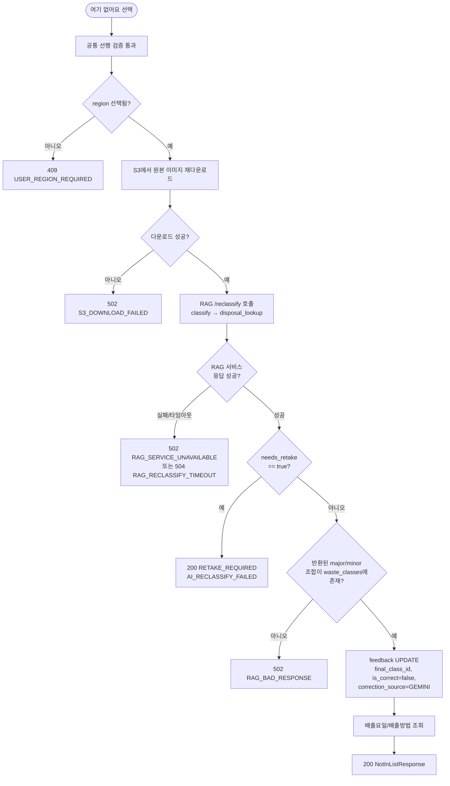
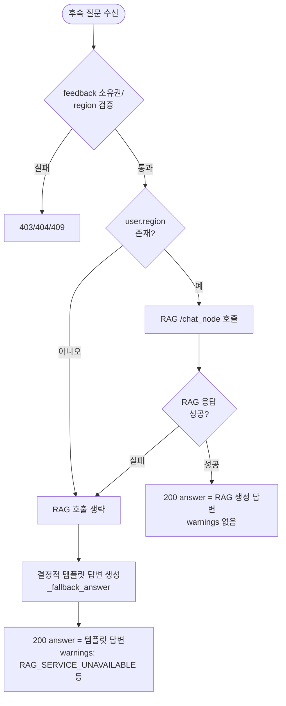

# 순서도 (Flowchart)

**버전** v1.0 · **기준일** 2026-09-28

시퀀스 다이어그램([08-sequence-diagram.md](08-sequence-diagram.md))이 "누가 누구를 호출하는가"를
보여준다면, 이 문서는 핵심 API의 **내부 분기 로직**(조건 판단 → 결과 분기)을 순서도로 정리합니다.

---

## 1. `POST /api/v1/analyze` 처리 순서도

**핵심 판단 지점**

| 분기 | 조건 | 결과 |
|---|---|---|
| 지역 미선택 게이트 | `users.region_id IS NULL` | 409 — 분석 자체를 시작하지 않음 |
| 메인 객체 게이트 | Vision이 중앙 객체를 하나도 탐지 못함 | 200 RETAKE_REQUIRED, **아무것도 저장 안 함** |
| 신뢰도 게이트 | Top-1 `score < VISION_CONFIDENCE_THRESHOLD`(0.5) | 200 RETAKE_REQUIRED, **저장은 이미 완료**(재학습 데이터 수집) |
| 외부 API 게이트 | 행정안전부/RAG 조회 실패 | 분석은 성공 처리, `warnings[]`에만 코드 기록 |

---

## 2. 피드백 3종 공통 선행 검증

---

## 3. `POST /feedback/{id}/not-in-list` 상세 분기 (RAG 재분류)

---

## 4. `POST /api/v1/chat` 답변 생성 분기

---

## 5. 참고

- 각 분기의 정확한 필드/코드: [15-error-specification.md](15-error-specification.md)
- 호출 순서(누가 누구를 부르는가): [08-sequence-diagram.md](08-sequence-diagram.md)
