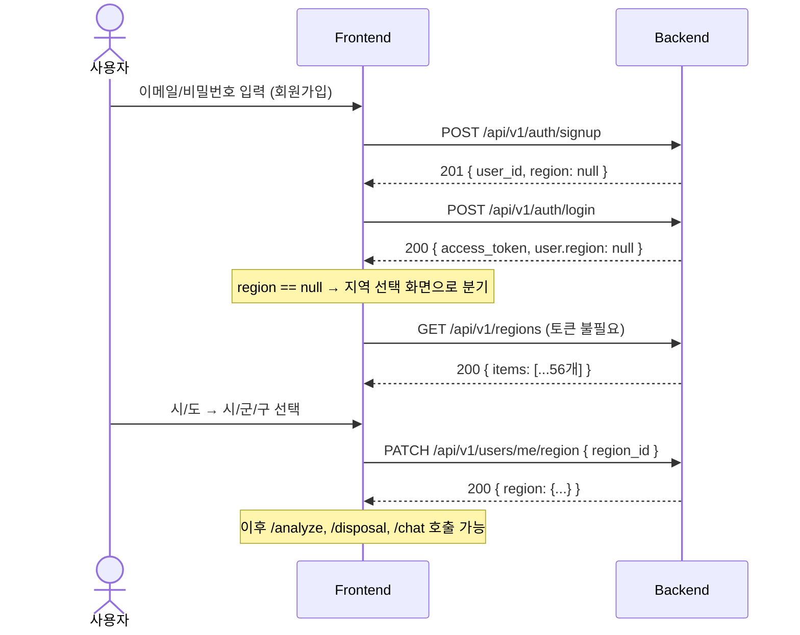
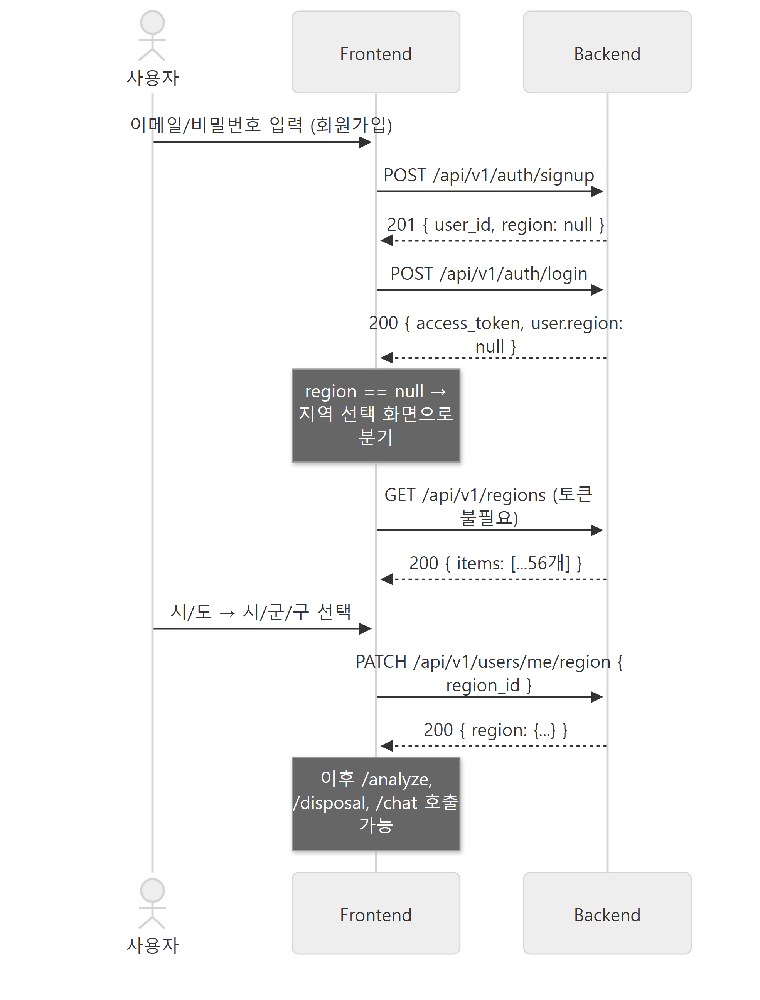
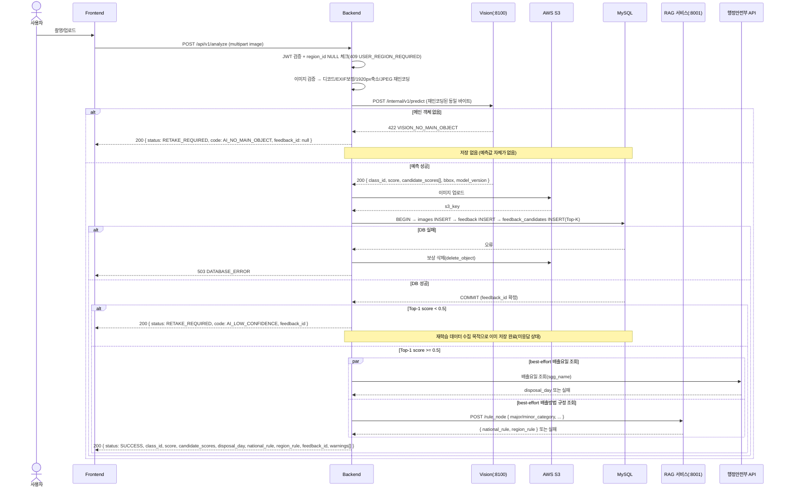
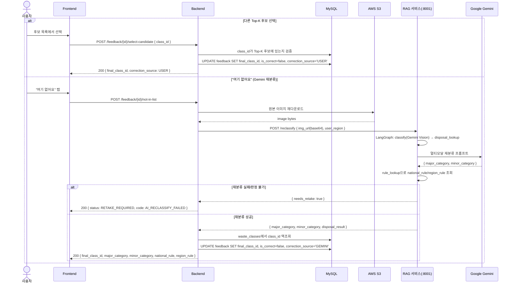
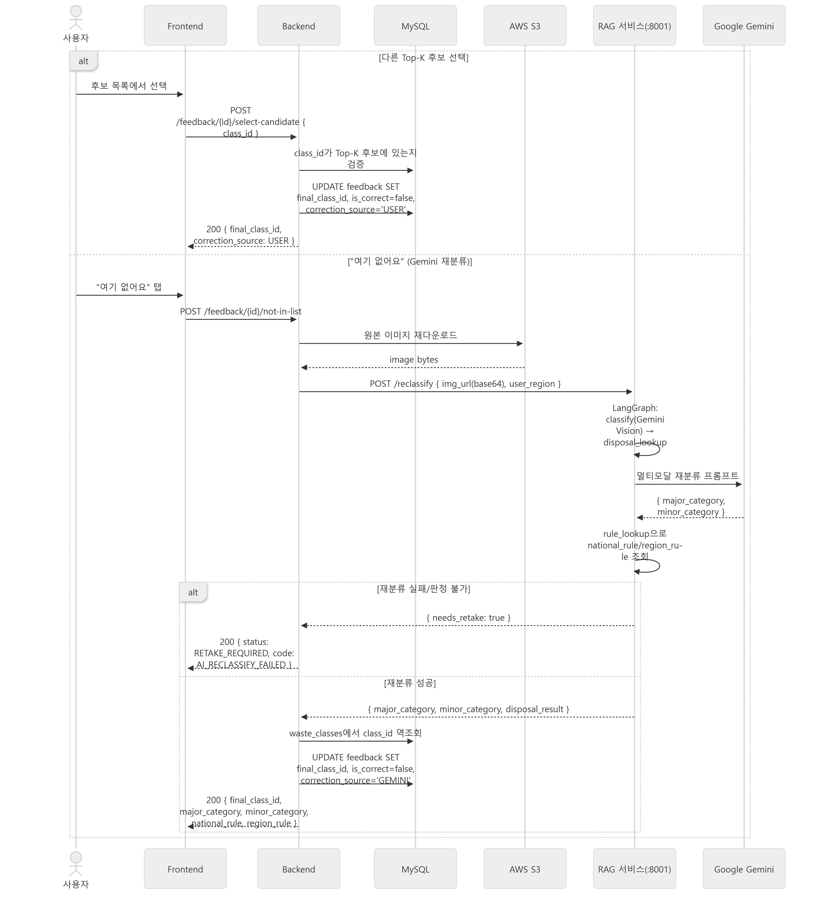
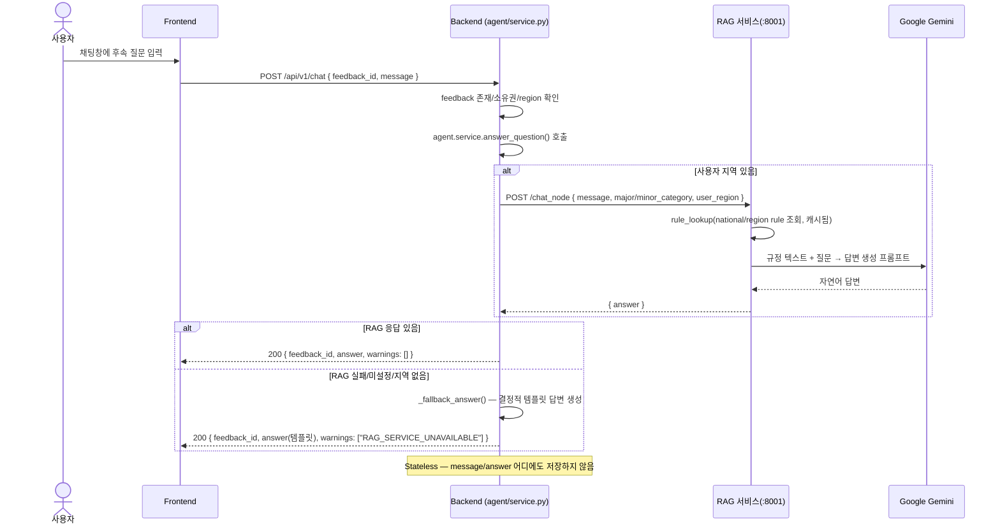
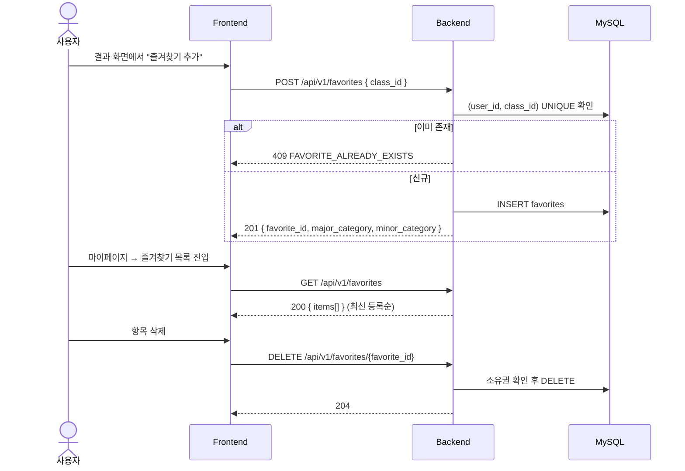
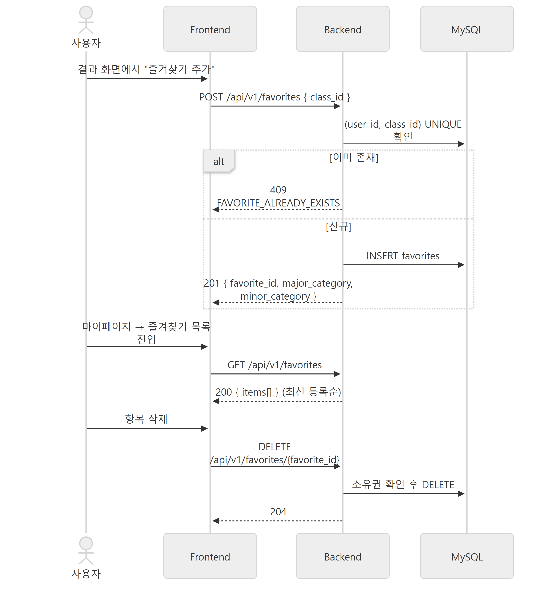

# 시퀀스 다이어그램

**버전** v1.0 · **기준일** 2026-09-28

이 문서는 분리쏙의 핵심 흐름을 시퀀스 다이어그램으로 정리합니다. 전체 아키텍처는
[09-service-architecture.md](09-service-architecture.md), 각 단계의 필드는
[10-api-specification.md](10-api-specification.md)를 참고하세요.

---

## 1. 회원가입 ~ 지역 선택 ~ 로그인

---

## 2. 이미지 분석 (`POST /api/v1/analyze`)

> 행정안전부 API와 RAG `/rule_node` 조회는 **서로 독립적인 best-effort 호출**입니다. 어느 한쪽이
> 실패해도 다른 쪽 결과와 분석 성공 자체에는 영향을 주지 않고, 실패 코드만 `warnings[]`에 추가됩니다.

---

## 3. 피드백 — "다른 후보 선택" / "여기 없어요" (Gemini 재분류)

> **알려진 미완성 지점**: RAG 그래프의 `judge`(재분류 결과 검증) 노드와 재시도 루프는 코드에는
> 있지만 현재 그래프 배선에서 비활성화되어 있어(§[09-service-architecture.md](09-service-architecture.md) §4.2),
> 위 다이어그램의 `classify → disposal_lookup`은 **검증 없이 1회 분류 결과를 그대로 사용**하는
> 현재 동작을 반영한 것입니다.

---

## 4. AI Agent 후속 질문 (`POST /api/v1/chat`)

---

## 5. 즐겨찾기

---

## 6. 참고

- 처리 단계의 분기 로직(성공/재촬영/오류)은 [07-flowchart.md](07-flowchart.md)에서 순서도로 다룹니다.
- 서비스별 내부 모듈 구조는 [09-service-architecture.md](09-service-architecture.md)를 참고하세요.
