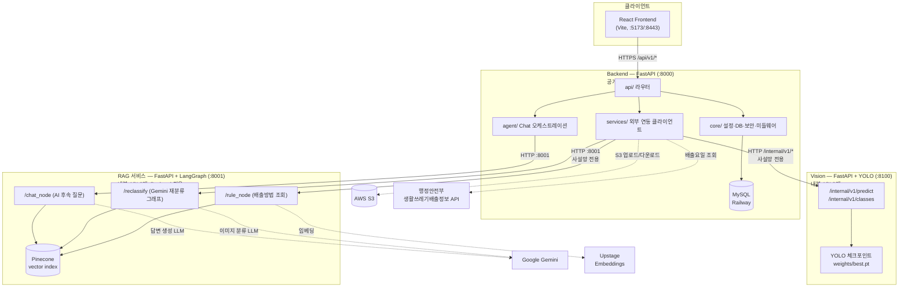
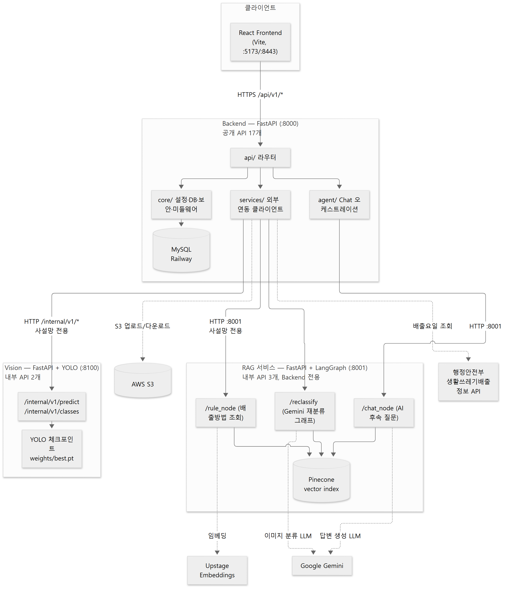

# 서비스 아키텍처

**버전** v1.0 · **기준일** 2026-09-28

---

## 1. 전체 구성 — 4개 프로세스

분리쏙은 **3개의 독립 서버 프로세스** + **1개의 정적 프론트엔드**로 구성됩니다.
세 서버는 각자 독립적으로 기동되며, 서로 HTTP로만 통신합니다(공유 메모리/프로세스 없음).





| 서버 | 역할 | 포트(기본) | 노출 대상 | 인증 |
|---|---|---|---|---|
| **Backend** | 인증·비즈니스 로직·DB·외부 연동 오케스트레이션 | `:8000` | Frontend | JWT |
| **Vision** | YOLO 중앙 객체 탐지 + Top-K 후보 | `:8100` | **Backend 전용**(사설망) | 없음(네트워크 경계로 차단) |
| **RAG** | 배출방법 규정 조회·AI Agent 답변 생성·Gemini 재분류 그래프 | `:8001` | **Backend 전용**(사설망, `127.0.0.1` 바인딩) | 없음 |

> RAG 서비스는 `scripts/run-dev.sh`/`run-dev.ps1`의 자동 기동 대상이 **아닙니다** — Backend·Vision과
> 달리 수동으로 별도 기동해야 합니다(`uv run uvicorn rag.main:app --host 127.0.0.1 --port 8001`).

---

## 2. Backend 내부 모듈 구조

```
backend/
├── main.py            FastAPI 앱 조립, 미들웨어/라우터 등록
├── api/                엔드포인트 라우터 (analyze, auth, chat, disposal, favorites, feedback, health, regions, users)
├── core/               config(환경변수) · database(SQLAlchemy 세션, KST 타임존) · security(JWT/bcrypt)
│                       · deps(get_current_user) · exceptions(AppError, 오류 카탈로그) · middleware(X-Request-ID) · paths
├── models/             SQLAlchemy ORM — 7개 테이블 (user, region, waste_class, image, feedback, feedback_candidate, favorite)
├── schemas/             Pydantic 요청/응답 스키마 (테이블당 1파일 + common/vision/chat)
├── services/            외부 연동 클라이언트
│   ├── vision_client.py        → Vision 서버 (predict)
│   ├── s3_service.py / local_storage.py / storage.py   → 이미지 저장소 (백엔드 전환 가능)
│   ├── public_waste_client.py  → 행정안전부 API
│   ├── disposal_service.py     → 행정안전부 API 래핑 + RAG 서비스 호출 3종(rule/chat/reclassify)
│   ├── gemini_service.py       → (레거시) Gemini 직접 호출 — 현재는 RAG 서비스가 대체, 미사용
│   └── image_processing.py / image_validation.py   → 업로드 검증·리사이즈·재인코딩
├── agent/               Chat 오케스트레이션 (service.py::answer_question) — RAG 응답 실패 시 결정적 폴백 생성
├── db/                  Master 데이터 시딩 (seed.py, taxonomy_loader.py)
└── tests/               pytest 104개 — 외부 서비스 불필요(전부 모킹)
```

**요청 처리 공통 경로**: `main.py`가 등록한 미들웨어가 모든 요청에 `X-Request-ID`를 부여 →
`core/deps.py::get_current_user`가 JWT 검증 → 각 `api/*.py` 라우터가 `services/`를 호출해
외부 연동을 수행 → `core/exceptions.py::AppError`가 던져지면 전역 핸들러가 §공통 오류 응답으로 직렬화.

---

## 3. Vision 서버 내부 구조

```
vision/
├── main.py             POST /internal/v1/predict, GET /internal/v1/classes, GET /health
├── inference.py         YOLO 로딩 + 메인 객체 선택 + Top-K 후보 추출
├── core/config.py       MODEL_PATH, VISION_CONFIDENCE_THRESHOLD, TOP_K, NMS 등
├── core/taxonomy.py     data/taxonomy/waste_classes.json 로딩
└── tests/               24개 (스키마 계약 + 실제 체크포인트 추론 검증)
```

**추론 파이프라인** (`inference.py`):
1. `model.predict()`를 매우 낮은 하한(`low_confidence_floor=0.05`)으로 1회 호출 — 이 하한보다도 낮으면
   "메인 객체 자체가 없음"으로 판단.
2. 살아남은 박스 중 `confidence × area × (1 − 중심으로부터의 정규화 거리)`가 최대인 박스를
   "메인 객체"로 선정(화면 중앙에 크고 확실하게 있는 물체를 우선).
3. 그 박스 위치의 원시 클래스 점수 텐서(NMS/argmax 이전)에서 상위 `TOP_K`개 클래스를 그대로 추출 —
   confidence threshold와 무관하게 **항상 정확히 TOP_K개**의 후보를 보장.
4. Top-1을 제외한 나머지를 `candidate_scores`로 반환, bbox는 0~1 정규화 XYXY로 변환.

체크포인트는 `MODEL_PATH` 환경변수 → `weights/best.pt` 고정 경로 순으로 로딩되며(자동 스캔은
개발 실행 스크립트의 책임이지 Vision 서버 자체 로직은 아님), 로드 실패 시에도 `/health`는
`model_loaded:false`로 200을 유지합니다(§4 장애 격리 참고).

---

## 4. RAG 서비스 내부 구조

`backend/`와 **완전히 독립된 별도 FastAPI 프로세스**입니다(양방향 import 없음 — 순수 HTTP 통신).

```
rag/
├── main.py                    FastAPI 앱, disposal/reclassify/chat 라우터 마운트, /cache_info
├── api/routes/
│   ├── disposal.py             POST /rule_node    — node2: 배출방법(national_rule/region_rule) 조회
│   ├── chat.py                 POST /chat_node    — node4: AI 후속 질문 답변
│   └── reclassify.py           POST /reclassify   — node1+3: Gemini 재분류 그래프 실행
├── src/
│   ├── agents/
│   │   ├── rule_lookup.py       find_national_rule / find_region_rule — 결정적 규칙 매칭(LLM 미사용)
│   │   ├── chatbot_node.py      규칙 조회 결과 + 사용자 질문 → Gemini 프롬프트 → 자연어 답변
│   │   ├── llm_classify_node.py Gemini Vision 재분류 (멀티모달)
│   │   ├── judge_node.py        재분류 결과 검증(현재 그래프 배선에서 비활성 — §4.2)
│   │   └── disposal_lookup_node.py  분류 결과 → rule_lookup 호출 → 규정 텍스트 구성
│   ├── graph/main_graph.py      LangGraph StateGraph — "여기 없어요" 재분류 전용
│   ├── ingestion/                오프라인 전처리: JSON → Document → 임베딩 업서트
│   ├── vectorstore/               Pinecone 클라이언트 래퍼
│   ├── retrieval/                 (보조) as_retriever 래퍼 — 실제 조회 경로는 rule_lookup.py가 직접 사용
│   └── prompts/templates.py       classify / judge / chatbot 3종 프롬프트 템플릿
├── data/raw/                    근거 법령 PDF(사람이 읽는 원본, 런타임 미사용)
├── data/metadata/                오프라인 전처리 산출 JSON(임베딩 원본) — 11-data-specification.md §2
└── configs/settings.yaml         LLM 모델명 등
```

### 4.1 검색(Retrieval) 방식

- 임베딩: Upstage `solar-embedding-2-passage`, 저장소: Pinecone 인덱스 `recycling-ssg`.
- 조회는 순수 벡터 유사도가 아니라 **메타데이터 필터 + 벡터 유사도**를 함께 사용합니다
  (`doc_type`, `major_category`, `minor_category`/`region`으로 먼저 좁힌 뒤 유사도 순 정렬) —
  키워드 검색이나 하이브리드 리트리버가 아니라, "구조화된 조회를 벡터 검색으로 흉내" 낸 방식입니다.
- `find_national_rule`은 정확한 (대분류, 소분류) 매치가 없으면 대분류만으로 재시도(예: YOLO의
  세분화된 "박카스병/맥주병/소주병" → RAG 사전의 더 굵은 "음료수병"으로 의미적 대응).
- `find_region_rule`은 사용자 지역이 경기도일 때만 동작(서울은 예외 규정 없음 — 조기 반환).
- **캐싱**: 두 함수 모두 `functools.lru_cache(maxsize=1024)`로 감싸져 있습니다. 조회 대상이
  "17개 고정 클래스 × 선택적 경기 시·군"으로 유한하기 때문에, 프로세스 메모리 캐시만으로 반복되는
  임베딩+벡터DB 왕복(건당 약 2초)을 제거할 수 있습니다. `scripts/warm_rule_cache.py`가 데모 전
  전체 조합을 미리 조회해 캐시를 예열합니다.

### 4.2 오케스트레이션(LangGraph) 사용 범위

LangGraph `StateGraph`는 **"여기 없어요"(재분류) 흐름에만** 사용됩니다. AI Agent 채팅(`/chat_node`)은
그래프를 거치지 않고 `chatbot_node()` 함수를 직접 호출하는 단순 파이프라인입니다.

- 노드: `classify`(Gemini Vision 분류) → `disposal_lookup`(규정 조회) → `END`
- `judge`(분류 결과 검증) 노드와 재시도 루프(`route_after_judge`, 최대 `MAX_CLASSIFY_RETRIES=2`)는
  **코드에는 존재하지만 현재 그래프 배선에서 주석 처리되어 비활성 상태**입니다 — 즉 현재는 Gemini의
  1차 분류 결과를 검증 없이 그대로 사용합니다. 활성화 여지가 있는 **알려진 미완성 지점**이므로
  [16-troubleshooting](../troubleshooting/README.md)에도 기록해 둡니다.
- `handle_direct_classification()` 헬퍼는 호출하는 곳이 없는 **죽은 코드**입니다.

자세한 시퀀스는 [08-sequence-diagram.md](08-sequence-diagram.md) §3, §4를 참고하세요.

---

## 5. Backend ↔ RAG 연동 지점 정리

| Backend 호출부 | RAG 엔드포인트 | 용도 | 실패 시 동작 |
|---|---|---|---|
| `services/disposal_service.py::get_rule_info_or_warn` | `POST /rule_node` | `/analyze` 성공 응답에 `national_rule`/`region_rule` 첨부 | best-effort — `warnings: ["RAG_SERVICE_UNAVAILABLE"]`만 남기고 분석 자체는 성공 처리 |
| `services/disposal_service.py::reclassify_or_raise` | `POST /reclassify` | `/feedback/{id}/not-in-list` 핵심 로직 | 핵심 기능이므로 **실패를 그대로 전파**(502/504 오류) |
| `agent/service.py::answer_question` → `disposal_service.get_chat_answer_or_warn` | `POST /chat_node` | `/chat` 답변 생성 | best-effort — 실패 시 `agent/service.py`의 결정적 템플릿 답변으로 폴백(오류 아님) |

`backend/agent/prompts.py`(자체 프롬프트 빌더)는 RAG 서비스 도입 이전 설계의 잔재로, 현재 어디서도
호출되지 않는 **죽은 코드**입니다.

---

## 6. 외부 의존성 및 장애 격리

| 외부 서비스 | 용도 | 없거나 실패할 때 |
|---|---|---|
| MySQL (Railway) | 회원/분석/피드백/즐겨찾기 저장 | 서비스 전체 불가 — `/ready`가 503 |
| AWS S3 | 분석 이미지 원본 저장 | `STORAGE_BACKEND=local`로 로컬 디스크 대체 가능 |
| 행정안전부 생활쓰레기배출정보 API | 지역별 배출요일 | `/analyze`는 성공 + `warnings`, `/disposal/schedule`은 5xx |
| RAG 서비스(:8001) | 배출방법 규정, AI Agent 답변, 재분류 | 배출방법/채팅은 best-effort 폴백, 재분류(`not-in-list`)는 오류로 전파 |
| Google Gemini (RAG 서비스 내부) | 이미지 재분류, 채팅 답변 생성 | 재분류는 RAG 서비스 오류로 전파, 채팅은 결정적 템플릿 답변으로 대체 |
| Upstage / Pinecone | 임베딩·벡터 검색 | RAG 서비스 자체가 규정 조회 불가 상태가 됨(위 RAG 서비스 행과 동일하게 전파) |

**설계 원칙**: Vision/RAG/외부 API 장애는 Backend 전체 장애로 번지지 않습니다. `/health`는 항상 200을
유지하며, 부가 정보(배출요일, 배출방법 규정)의 실패는 `warnings` 배열로만 알리고 핵심 응답은 계속
내려갑니다. 단, 사용자가 명시적으로 요청한 핵심 동작(재분류, 직접 배출정보 조회)의 실패는 오류로
정직하게 알립니다.

---

## 7. 배포 토폴로지 개요

로컬 개발 기준 포트 배치이며, 운영 환경의 실제 호스팅 구성은 [deployment/](../deployment/)를 참고하세요.

| 프로세스 | 기동 방법(개발) | 비고 |
|---|---|---|
| Backend | `scripts/run-dev.sh` / `.ps1`이 자동 기동 | `:8000` |
| Vision | 〃 (체크포인트 자동 탐색) | `:8100` |
| RAG | 수동 기동 (`uv run uvicorn rag.main:app --port 8001`) | `:8001`, `127.0.0.1` 전용 바인딩 — 외부 미노출 |
| Frontend | `npm run dev` (Vite) | `:8443`(또는 `:5173`), `/api` → Backend 프록시 |

컨테이너화(Docker)나 CI/CD 파이프라인은 **현재 리포지토리에 구성되어 있지 않습니다** — 자세한 내용과
수동 배포 절차는 [deployment/README.md](../deployment/README.md)를 참고하세요.

---

## 8. 참고

- API 계약: [10-api-specification.md](10-api-specification.md)
- 시퀀스 다이어그램: [08-sequence-diagram.md](08-sequence-diagram.md)
- AI 모델(YOLO) 상세: [13-ai-model-yolo.md](13-ai-model-yolo.md)
- 배포: [../deployment/README.md](../deployment/README.md)
