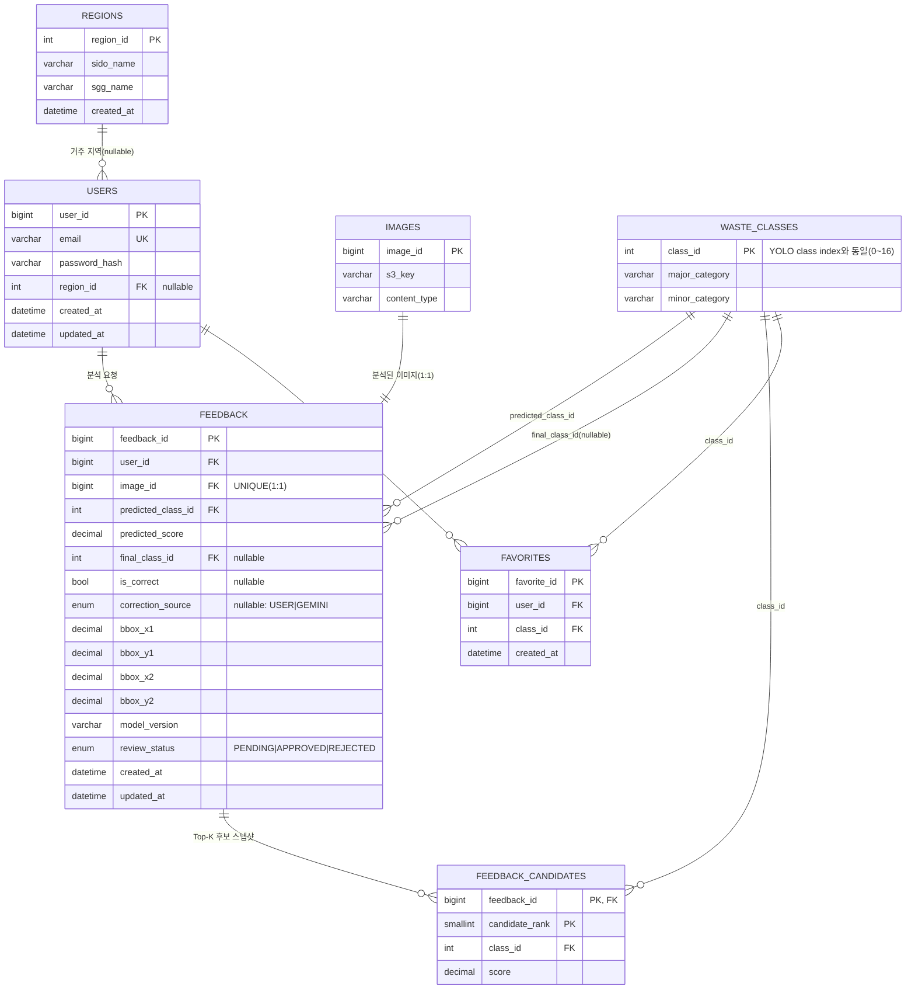
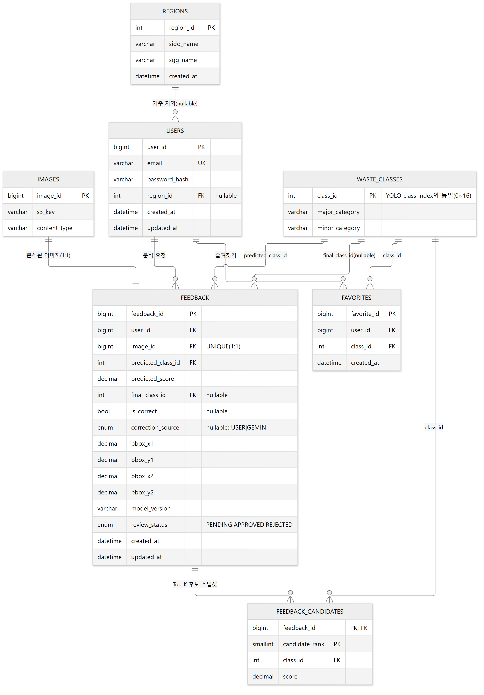

# ERD (Entity Relationship Diagram)

**버전** v1.0 · **기준일** 2026-09-28 · **DB 엔진** MySQL 8.0 (Railway 호스팅, InnoDB / utf8mb4)

> 이 문서는 실제 배포 DB(`information_schema` + `SHOW CREATE TABLE` 조회)와 `backend/models/*.py`
> (SQLAlchemy 모델)를 기준으로 작성했습니다. 컬럼 단위 상세 스펙(타입/제약조건/인덱스)은
> [11-data-specification.md](11-data-specification.md)를 참고하세요.

---

## 1. 전체 ERD

---

## 2. 엔티티 요약

| 엔티티 | 성격 | 행 수 | 비고 |
|---|---|---|---|
| `REGIONS` | Master (시드) | 56 고정 | 서울 25개 자치구 + 경기 31개 시·군 |
| `WASTE_CLASSES` | Master (시드), **YOLO 계약** | 17 고정 | `class_id` = YOLO class index. 서비스 전체의 분류 체계 단일 소스 |
| `USERS` | 트랜잭션 | 가변 | 이메일/비밀번호 해시 + 현재 선택 지역 |
| `IMAGES` | 트랜잭션 | 가변 | 실제 바이트는 S3, 여기는 Object Key만 |
| `FEEDBACK` | 트랜잭션 | 가변 | 분석 1건 = 1행. AI 예측 + 사용자 피드백을 한 행에 누적 |
| `FEEDBACK_CANDIDATES` | 트랜잭션 (스냅샷) | 가변 | 분석 시점 Top-K 후보. 이후 불변 |
| `FAVORITES` | 트랜잭션 | 가변 | 사용자 ↔ 분류 다대다의 실체화 |

> `chat_sessions` / `chat_messages` 같은 대화 테이블은 **존재하지 않습니다** — `/api/v1/chat`은
> Stateless로 설계되어 질문/답변을 저장하지 않습니다.

---

## 3. 관계 상세

### 3.1 `REGIONS` 1 — N `USERS`
- `users.region_id`는 **nullable** — 회원가입 시점에는 지역을 받지 않으므로 가입 직후 항상 NULL.
- `ON DELETE SET NULL` — 지역 마스터가 삭제되면 사용자는 "지역 미선택" 상태로 되돌아감(사용자 삭제 아님).

### 3.2 `USERS` 1 — N `FEEDBACK`, `USERS` 1 — N `FAVORITES`
- `feedback.user_id`는 `ON DELETE RESTRICT` — 분석 이력이 있는 사용자는 삭제 불가(이력 보존 우선).
- `favorites.user_id`는 `ON DELETE CASCADE` — 사용자 삭제 시 즐겨찾기는 같이 삭제(이력으로 취급하지 않음).

### 3.3 `IMAGES` 1 — 1 `FEEDBACK`
- `feedback.image_id`에 UNIQUE 제약 → 이미지 1장당 분석 결과 1건만 존재.
- `images`는 역방향 FK가 없음(다른 테이블이 `images`를 참조하는 구조) — 이미지 자체는 소유자 개념이 없고,
  소유자는 항상 `feedback.user_id`를 거쳐 추적됩니다.

### 3.4 `WASTE_CLASSES` 1 — N (`FEEDBACK.predicted_class_id`, `FEEDBACK.final_class_id`, `FEEDBACK_CANDIDATES.class_id`, `FAVORITES.class_id`)
- 하나의 `waste_classes` 행이 `feedback`에서 **두 개의 서로 다른 FK**(예측값/최종값)로 참조됩니다.
- 이 네 FK 모두 `ON DELETE RESTRICT`(기본값) — 분류 체계는 참조 중이면 삭제 불가.

### 3.5 `FEEDBACK` 1 — N `FEEDBACK_CANDIDATES`
- 복합 PK `(feedback_id, candidate_rank)` — 분석 1건당 순위가 매겨진 후보 목록(Top-1 제외, 최대 `VISION_TOP_K - 1`개).
- `ON DELETE CASCADE` — `feedback`이 삭제되면 후보 스냅샷도 함께 삭제.
- **분석 시점 스냅샷**이라는 점이 중요합니다 — 이후 사용자가 어떤 후보를 선택하든 이 테이블 자체는 변하지 않고,
  `feedback.final_class_id`만 갱신됩니다.

---

## 4. 설계 상의 핵심 결정

| 결정 | 이유 |
|---|---|
| `images`에 `user_id`를 두지 않음 | 소유자는 `feedback.user_id`로 단일화. 실제 배포 DB 스키마와 일치시킨 결과(2026-09-13) |
| `class_id`를 YOLO index와 공유 | Vision 서버와 Backend가 같은 `data/taxonomy/waste_classes.json`을 시드 소스로 사용 — 모델 출력과 DB 행이 항상 1:1 |
| `feedback`에 문자열(대/소분류)을 저장하지 않음 | `class_id` JOIN으로만 해석 — 분류 체계가 바뀌어도 과거 데이터가 깨지지 않음 |
| `feedback_candidates`를 별도 테이블로 분리 | Top-K는 가변 개수(최대 4개)이므로 정규화. `(feedback_id, class_id)` UNIQUE로 중복 후보 방지 |
| `chat_sessions`/`chat_messages` 없음 | AI Agent 채팅은 Stateless 요구사항(대화 미저장)에 따라 애초에 테이블을 두지 않음 |
| `feedback_result_state` CHECK 제약 | "미응답/확인/정정" 3가지 조합만 허용해 DB 레벨에서 잘못된 상태 조합을 원천 차단 (자세한 조합은 [11-data-specification.md](11-data-specification.md) 참고) |

---

## 5. 참고

- 컬럼 단위 상세(타입/NULL/기본값/제약조건/인덱스): [11-data-specification.md](11-data-specification.md)
- Master 데이터 원본: `data/taxonomy/regions.json`, `data/taxonomy/waste_classes.json`
- 시딩 코드: `backend/db/seed.py`, `backend/db/taxonomy_loader.py`
- SQLAlchemy 모델: `backend/models/*.py`
- 원본 조사 문서: [`docs/DATABASE_SCHEMA.md`](../DATABASE_SCHEMA.md)
